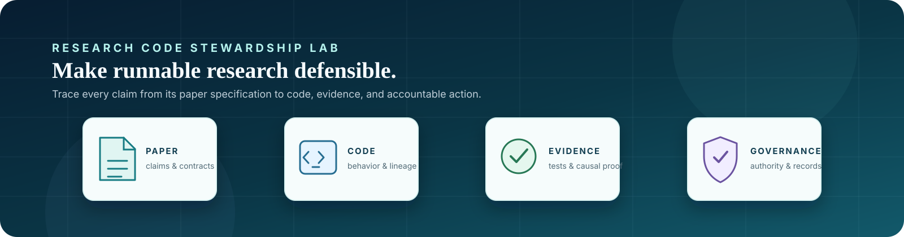

# LLM4SBR Research Audit Training · v2



> **One research case. Four layers of evidence.** Learn to distinguish code that runs from research that is defensible.

[中文入门](../docs/GETTING_STARTED.md) · [English start guide](../docs/GETTING_STARTED_EN.md) · [Repository map](../REPOSITORY_MAP.md) · [Paper](https://arxiv.org/abs/2402.13840) · [Original implementation](https://github.com/tsinghua-fib-lab/LLM4SBR)

## What this course trains

LLM4SBR is a four-level, learner-facing progression for auditing a research system across the whole chain:

```text
paper specification → implementation behavior → experimental evidence → agent governance
```

The exercise does not reward guessing which candidate looks familiar. It asks for a traceable argument: the location, the violated contract, a minimal counterexample, the causal effect, and the smallest safe repair.

## Start in five minutes

From the repository root, install the public runtime dependency and run the learner-visible checks:

```bash
python -m pip install -r requirements.txt
python LLM4SBR_research_audit_training_v2/run_all_public_checks.py
```

Expected output:

```text
LEVEL 1: PASS
LEVEL 2: PASS
LEVEL 3: PASS
LEVEL 4: PASS
```

Then read [PROGRESSION.md](PROGRESSION.md) and begin with [Level 1](level_1_algorithm_semantics/README.md). Work through the levels in numerical order.

## The four audit layers

| Level | Question you are learning to answer | First document | Public validation |
| --- | --- | --- | --- |
| **1 — Algorithm semantics** | Does the runnable implementation preserve formulas, tensors, masks, objectives, and gradients? | [Level 1 brief](level_1_algorithm_semantics/README.md) | `python LLM4SBR_research_audit_training_v2/level_1_algorithm_semantics/run_smoke.py` |
| **2 — Pipeline integrity** | Do sample identity, split, batching, evaluation, and checkpoint lineage agree end to end? | [Level 2 brief](level_2_pipeline_integrity/README.md) | `python LLM4SBR_research_audit_training_v2/level_2_pipeline_integrity/run_smoke.py` |
| **3 — Scientific validity** | Is the comparison fair, and does the evidence support the strongest claimed conclusion? | [Level 3 brief](level_3_scientific_validity/README.md) | `python LLM4SBR_research_audit_training_v2/level_3_scientific_validity/validate_evidence_schema.py` |
| **4 — Agent experiment governance** | Were approvals, budgets, records, and protected evidence handled within protocol? | [Level 4 brief](level_4_agent_experiment_governance/README.md) | `python LLM4SBR_research_audit_training_v2/level_4_agent_experiment_governance/validate_ledger_schema.py` |

Each level has a learner-visible `ANSWER_SHEET.md` for recording the evidence chain. Complete it before consulting material marked for instructors or post-completion release.

## How to use the package

### Learner

1. Read the level brief and its frozen contract before inspecting implementations.
2. Run the relevant public validation to learn what it does—and does not—establish.
3. Build a minimal counterexample and record a causal argument in that level’s `ANSWER_SHEET.md`.
4. Advance only after you can explain why a result may still look plausible while violating the underlying research contract.

### Reviewer or maintainer

Run the four learner-visible validations after changing learner-facing files:

```bash
python LLM4SBR_research_audit_training_v2/run_all_public_checks.py
```

It runs the four public smoke and schema validations. The repository's GitHub Actions also checks the public package structure on every push and pull request. Pair both with a human review of the paper mapping, the frozen protocol, and any claim boundary that code alone cannot prove.

### Research owner

To build an equivalent course for another paper, start with the repository’s reusable [research-code-audit-training Skill](../skills/research-code-audit-training/SKILL.md). Create and approve a four-level design specification before generating candidates or evaluation artifacts.

## Evidence boundaries

### Public `PASS` is not a scientific verdict

A passing public check means the public validator, schema, or smoke contract held for that run. It does **not** establish that an implementation is faithful to the paper, an experiment is fair, a scientific conclusion follows, or an agent action was authorized.

### Answer isolation is part of the course design

Learner-facing material and instructor material are intentionally separated. Do not search for or use instructor-only or post-completion material while solving a level; public validators do not import it. The goal is to preserve independent audit reasoning rather than turn the task into answer retrieval.

## Optional paper-first route

Before looking at code, you can create a source-blind paper baseline with the [Paper Learning and Reproduction Protocol](../docs/PAPER_ONLY_REPRODUCTION_PROTOCOL.md). This produces a paper-grounded study guide without treating the existing implementation as the scientific specification.

## Course map

- [Framework overview](FRAMEWORK_OVERVIEW.md): why research-code stewardship matters and the complete training framework.
- [Progression](PROGRESSION.md): the required order and evidence standard for Levels 1–4.
- [Repository start guide](../docs/GETTING_STARTED.md): choose a learner, reviewer, or research-owner path.
