# Research Code Stewardship Lab

**Language:** [Chinese README](README.md) · **English README**

## Training research judgment in the Coding-Agent era

Research Code Stewardship Lab is a training repository for tasks that combine a **research paper, a source-code repository, and executable experiments**. It is designed to teach a capability that is easy to miss when coding agents become very productive:

> deciding whether a runnable implementation still preserves the paper's algorithm, experimental protocol, scientific evidence, and governance constraints.

The repository does not primarily train faster code writing. It trains the ability to detect small, plausible, executable changes that can invalidate a training objective, introduce data leakage, make a comparison unfair, overstate a claim, or let an agent act outside its authorization.

The first complete case study is **LLM4SBR**, a session-based recommendation system using large language models. The repository links to the official research sources and contains a four-level audit curriculum, validation infrastructure, and a reusable Skill for generating similar training packages from other papers.

## LLM4SBR paper and original implementation

This project respects and preserves the original research sources. The original paper and repository are the research object; the audit candidates and training materials in this repository are separate educational artifacts.

- [LLM4SBR paper (arXiv:2402.13840)](https://arxiv.org/abs/2402.13840)
- [Original implementation: tsinghua-fib-lab/LLM4SBR](https://github.com/tsinghua-fib-lab/LLM4SBR)
- [Reference paper-study guide](docs/examples/LLM4SBR_PAPER_STUDY_GUIDE.md)

The original authors' conclusions, attribution, and source-code rights remain with the authors and their official distribution channels. This repository does not claim to replace the paper or the original implementation.

## Why this repository exists

Coding agents can now read repositories, construct frameworks, implement models and losses, write tests, run experiments, recover interrupted jobs, and summarize results. The scarce human capability is therefore moving upward:

- Is the implementation faithful to the mathematical definition?
- Are data identities, splits, checkpoints, and metrics still aligned?
- Is the comparison fair and the evidence sufficient for the claim?
- Did the agent stay within its permissions, budget, approval, and record-keeping boundaries?

This lab turns those questions into reproducible, evidence-based exercises. It is intended for research programmers, graduate students, research engineers, and people who supervise coding agents in scientific workflows.

## Repository contents

```text
README.md                              Chinese overview and general framework
README_EN.md                           This English overview
REPOSITORY_MAP.md                      Repository navigation
LICENSE                                Apache-2.0 license for original software
DOCUMENTATION_LICENSE.md               CC BY 4.0 notice for original documentation
THIRD_PARTY_NOTICES.md                 Third-party sources, exclusions, and access links
LLM4SBR_code_judgement_training/       Earlier five-candidate code-judgment exercise
LLM4SBR_research_audit_training_v2/    Complete four-level audit package
  level_1_algorithm_semantics/         Formula and algorithm semantics
  level_2_pipeline_integrity/          Data, training, and evaluation integrity
  level_3_scientific_validity/         Fairness, evidence, and scientific claims
  level_4_agent_experiment_governance/ Agent permissions, budget, approvals, and audit trail
  run_all_public_checks.py             Public validation entry point
skills/research-code-audit-training/   Portable training-package generation Skill
docs/                                  Protocols, examples, and implementation decisions
  PAPER_ONLY_REPRODUCTION_PROTOCOL.md  Source-blind paper study and clean-room protocol
  examples/LLM4SBR_PAPER_STUDY_GUIDE.md
                                        Source-blind study example
tests/                                 Package contracts and validation entry points
```

## Recommended learning path

1. Read this overview and the [repository map](REPOSITORY_MAP.md).
2. Study the paper without opening the implementation by following the [source-blind protocol](docs/PAPER_ONLY_REPRODUCTION_PROTOCOL.md).
3. Use the [LLM4SBR paper-study example](docs/examples/LLM4SBR_PAPER_STUDY_GUIDE.md) to build a `PRE_AUDIT_BASELINE`.
4. Work through the [four-level package](LLM4SBR_research_audit_training_v2/README.md), recording evidence rather than only selecting a candidate letter.
5. If you want to generate a package for another paper, install and use the [Research Code Audit Training Skill](skills/research-code-audit-training/SKILL.md).

Public learner materials intentionally do not contain candidate answers, mutation locations, or hidden probes. Teacher-only answers and verification artifacts remain isolated.

## End-to-end workflow for paper reproduction and research-code stewardship training

The diagram below separates the responsibilities of the learner, the Coding Agent/Skill, and the human research owner. Paper study remains source-blind; candidate implementation begins only after the human freezes the protocol and approves the design; public and hidden checks establish the training-package contract but never replace scientific judgment.

```mermaid
flowchart TD
    START(["Research inputs<br/>paper · appendix · official source · data documentation"]) --> SB

    subgraph P1["Phase A · Source-Blind Paper Study"]
        SB["Isolated study workspace<br/>paper and supplementary materials only"] --> GUIDE["Produce PAPER_STUDY_GUIDE.md<br/>label P / I / A / E evidence"]
        GUIDE --> BASE["Build PRE_AUDIT_BASELINE<br/>equations · tensor contracts · data flow · metrics · claim boundaries"]
    end

    BASE --> FREEZE["Human freezes the audit protocol<br/>correctness · split · metric · baseline · budget · permissions"]
    FREEZE --> MAP["Skill maps paper to source<br/>record correspondences, conflicts, and executable invariants"]
    MAP --> SPEC["Four-level design specification<br/>one trusted + four single-error candidates per level"]
    SPEC --> APPROVE{"Does the human approve<br/>the task and scientific protocol?"}
    APPROVE -- "No: revise specification" --> MAP
    APPROVE -- "Yes" --> TDD

    subgraph P2["Phase B · Test-Driven Generation and Isolated Verification"]
        TDD["RED → implement → GREEN → review → correct"] --> LEVELS["Generate Levels 1–4<br/>semantics → pipeline → validity → governance"]
        LEVELS --> PUBLIC["Learner area<br/>candidates · ANSWER_SHEET · public smoke checks"]
        LEVELS --> HIDDEN["Teacher-only area<br/>answer map · mutation ledger · hidden probes · minimal fixes"]
        PUBLIC --> VERIFY{"Do regression and<br/>answer-leakage checks pass?"}
        HIDDEN --> VERIFY
        VERIFY -- "No" --> TDD
    end

    VERIFY -- "Yes" --> READY["Release training package<br/>public PASS establishes only the package contract"]

    subgraph P3["Phase C · Four-Level Learner Audit"]
        READY --> L1["Level 1<br/>prove local algorithm semantics"]
        L1 --> L2["Level 2<br/>trace data identity and state"]
        L2 --> L3["Level 3<br/>reconstruct fairness and the evidence chain"]
        L3 --> L4["Level 4<br/>audit permissions, approvals, budgets, and records"]
        L4 --> ANSWER["Submit an evidence-based answer<br/>location · rule · counterexample · causal impact · safe repair"]
    end

    ANSWER --> REVIEW{"Does the evidence meet<br/>the progression standard?"}
    REVIEW -- "No: learn or gather more evidence" --> L1
    REVIEW -- "Yes" --> HUMAN["Human final judgment<br/>faithful implementation · credible experiment · permitted claim"]
    HUMAN --> END(["Auditable research conclusion<br/>or migration to another paper"])
    END -. "new paper / error family / lessons learned" .-> START

    classDef start fill:#fed7aa,stroke:#c2410c,color:#374151,stroke-width:2px;
    classDef success fill:#a7f3d0,stroke:#047857,color:#374151,stroke-width:2px;
    classDef decision fill:#fef3c7,stroke:#b45309,color:#374151,stroke-width:2px;
    classDef agent fill:#ddd6fe,stroke:#6d28d9,color:#374151,stroke-width:2px;
    classDef primary fill:#93c5fd,stroke:#1e3a5f,color:#374151,stroke-width:1.5px;

    class START start;
    class END,READY,HUMAN success;
    class APPROVE,VERIFY,REVIEW decision;
    class MAP,SPEC,TDD,LEVELS agent;
    class SB,GUIDE,BASE,FREEZE,PUBLIC,HIDDEN,L1,L2,L3,L4,ANSWER primary;
```



---

## 0. Research Code Audit Training Skill

### 0.1 What the Skill does

`research-code-audit-training` is not a model and not a replacement for Codex. It is a set of professional instructions that a coding agent follows to turn a paper and its source repository into a verifiable, four-level audit-training package.

Each level normally contains five interface-compatible, runnable candidates: one faithful implementation and four candidates that each contain one subtle, high-impact error. The objective is not to find syntax errors. The objective is to determine whether a working experiment still represents what the paper claims.

The four audit objects are:

1. **Algorithm semantics** — formulas, operators, indexing, normalization, and gradient paths;
2. **Pipeline integrity** — sample identity, splits, permutations, checkpoints, and evaluation state;
3. **Scientific validity** — fair comparisons, information conditions, statistical evidence, and claim scope;
4. **Agent experiment governance** — permissions, approvals, resource budgets, failure records, and protected evidence.

The agent can read, design, implement, mutate, test, and package the materials. A human must freeze the scientific protocol, approve the design, resolve ambiguity, and make the final judgment about evidence and claims.

### 0.2 Inputs and safety boundaries

Provide the Skill with:

1. the paper (PDF, source, or readable path);
2. the author's source repository or a local source directory;
3. a new writable output directory;
4. runtime constraints such as Python/PyTorch versions, smoke-test limits, GPU limits, and data restrictions;
5. a protection list describing files and resources that must not be modified, uploaded, accessed, or fully executed.

Treat the paper, original source, and data as read-only. Candidate implementations, answer mappings, and hidden probes belong in the training package and must not overwrite the original research materials.

If the paper and source disagree, the Skill must report the conflict and its evidence. It must not silently treat the current source as the definition of scientific correctness.

### 0.3 Skill files

- [Main Skill](skills/research-code-audit-training/SKILL.md) — trigger conditions, workflow, TDD sequence, and material isolation;
- [Four-level framework](skills/research-code-audit-training/references/four-level-framework.md) — level boundaries and error families;
- [Level 3/4 implementation lessons](skills/research-code-audit-training/references/level3-level4-implementation-lessons.md) — structured evidence for scientific dossiers and governance timelines;
- [Quality gates](skills/research-code-audit-training/references/quality-gates.md) — single-error, anti-guessing, false-positive, RED/GREEN, and release checks;
- [Artifact contracts](skills/research-code-audit-training/references/artifact-contracts.md) — manifests, ledgers, claims, and validation entry points;
- [Domain adaptation guide](skills/research-code-audit-training/references/domain-adaptation.md) — adapting session, candidate, checkpoint, and related concepts to other fields;
- [Design-spec template](skills/research-code-audit-training/assets/design-spec-template.md) — specification to approve before implementation;
- [Answer-sheet template](skills/research-code-audit-training/assets/answer-sheet-template.md) — evidence-based learner response format;
- [Package validator](skills/research-code-audit-training/scripts/validate_training_package.py) — structural and leakage checks.

### 0.4 Install in Codex

From the repository root:

```bash
mkdir -p ~/.codex/skills
cp -R skills/research-code-audit-training ~/.codex/skills/
```

Start a new Codex task and invoke:

```text
$research-code-audit-training
```

If a previous copy exists, replace it deliberately so that the Skill version and its validation rules are consistent.

### 0.5 First-use prompt

Copy the following prompt and replace the three paths:

```text
Use $research-code-audit-training to design a four-level research-code audit training package from the paper and source code below.

Paper: /absolute/path/to/paper.pdf
Source repository: /absolute/path/to/source-repository
Output directory: /absolute/path/to/training-package

Work as follows:
- Read the paper and source and map the paper's claims to the implementation. Do not modify the original files.
- Produce a four-level design specification first and wait for my approval before generating candidates.
- For every level, generate five runnable, interface-compatible candidates: one faithful implementation and four candidates with one subtle, high-impact error each.
- Use public checks, hidden probes, and regression tests to verify that the package is usable and that each mutation is detectable by its intended evidence.
- Keep answer mappings, mutation locations, and hidden probes in a teacher-only directory.
- Do not access the internet, run full training, or alter the paper and original source unless I explicitly approve it.
```

For design discussion only:

```text
Use $research-code-audit-training to map the paper to the source, freeze the experimental protocol, and propose the four-level design specification only. Do not generate candidate code until I approve the specification.
```

### 0.6 Outputs and quality control

A completed package normally contains:

- learner instructions and answer sheets for all four levels;
- five candidates or experiment dossiers per level;
- public smoke checks and a top-level entry point;
- isolated teacher answers, mutation records, minimal fixes, and hidden probes;
- a design specification, RED/GREEN test history, implementation report, and known limitations.

The Skill should follow this sequence:

1. verify the paper, source, environment, protection paths, and resource boundaries;
2. map formulas, code locations, experimental rules, and executable invariants;
3. present the four-level design specification and wait for human approval;
4. implement each level using RED → implementation → GREEN → review → correction;
5. produce learner materials, isolated answers, hidden probes, and an implementation report;
6. run public checks, package-outside hidden validation, reproducibility, leakage, and release checks;
7. declare completion only when the evidence supports the package contract.

Passing tests proves only that the encoded checks pass. It does not prove that the research question, data protocol, metric, or scientific claim is itself correct.

### 0.7 Source-blind paper study before code auditing

Before opening the implementation, build an independent paper baseline. This prevents the current source from silently becoming the definition of what the paper “must have meant.” The complete protocol is [PAPER_ONLY_REPRODUCTION_PROTOCOL.md](docs/PAPER_ONLY_REPRODUCTION_PROTOCOL.md).

Use **Mode A: Source-Blind Pre-Audit Learning** for the standard four-level curriculum. Use **Mode B: Paper-Only Clean-Room Reproduction** when no source exists and you need to plan an independent reproduction.

Create a separate study directory containing only:

1. the paper;
2. its appendix or supplementary material;
3. necessary dataset documentation;
4. the reproduction protocol.

Do not place the original source, candidates, answer files, or hidden-test directories in that workspace. The safest setup is a separate Codex task whose workspace root cannot see the training repository.

Recommended Mode A prompt:

```text
Read and strictly follow:
/absolute/path/to/paper-study/PAPER_ONLY_REPRODUCTION_PROTOCOL.md

Use Mode A: Source-Blind Pre-Audit Learning.

The only readable root is: /absolute/path/to/paper-study
Paper: /absolute/path/to/paper-study/paper.pdf
Output: /absolute/path/to/paper-study/PAPER_STUDY_GUIDE.md

Build an independent paper baseline before seeing any implementation. Do not search for, read, cite, or infer the author's source, third-party implementations, candidate files, answer mappings, hidden probes, tests, or Git history.

Deliver in one PAPER_STUDY_GUIDE.md:
- Units 1–5 and the engineering overview between Units 1 and 2;
- [P]/[I]/[A]/[E] evidence labels and one assumption ledger;
- a PRE_AUDIT_BASELINE;
- a Level 1–4 handoff table and readiness checklist.

Cover the task and contribution, end-to-end data flow, formulas, tensor shapes, axes, masks, ID/target spaces, loss, gradient path, data split, checkpoint/test boundaries, metrics, comparison conditions, and claim scope.

Do not generate project source code, run training, or judge candidate answers. Explanatory pseudocode must not be presented as the author's implementation. Anything not specified by the paper remains an explicit [A] assumption.
```

Before Level 1, confirm that the guide contains the five Units, traceable paper evidence, shape/axis/mask/target/loss/gradient contracts, split and metric boundaries, a `PRE_AUDIT_BASELINE`, and a Level 1–4 handoff table. It must not contain candidate labels, answer mappings, source locations, or hidden rules.

### 0.8 Prompt for deciding where a learner should start

If you do not know which level to begin with, ask an agent to act as a learning guide rather than solve the exercise:

```text
I am about to start the four-level research-code audit training in this repository. Act as a learning guide; do not solve the exercise for me.

Based on my paper, source, training-package paths, and background, first assess whether I have the minimum knowledge required for the current level. If not, teach only the concepts needed to begin and do not reveal candidate answers, mutation locations, or hidden rules.

Then tell me:
1. whether I should start at Level 1, 2, 3, or 4, and why;
2. which files to read, in order;
3. which public commands to run;
4. what must be audited and what is easiest to confuse;
5. what evidence to record in ANSWER_SHEET.md;
6. how to decide that I am ready for the next level.

Do not open or cite teacher-only answer or hidden-probe directories. Do not guess from candidate letters, code length, comments, or output values. Do not tell me which candidate is correct. The goal is to train the ability to audit code that runs but may not preserve scientific meaning.
```

---

## 1. Why this training is needed

The important question is no longer only “Can the agent write code?” It is:

> When the code compiles, training runs, loss decreases, and the result table looks plausible, can a human still determine whether the system implemented the right problem, followed the right protocol, and supports the claimed conclusion?

The most dangerous research-code errors often do not cause compilation failures. A one-line change to a normalization axis, boundary condition, gradient path, split unit, checkpoint rule, or reporting rule can invalidate the objective or the scientific conclusion.

The curriculum therefore develops four capabilities:

1. verify local algorithm semantics against mathematical definitions;
2. verify identity and state consistency across the data, training, and evaluation pipeline;
3. verify fairness, evidence, and claim scope at the experiment level;
4. verify that an agent acted within permissions, budgets, approvals, and record-keeping rules.

## 2. What coding agents can and cannot guarantee

OpenAI describes GPT-5.6 Sol as a model for complex coding, research, computer use, and high-value open-ended tasks. Ultra is an orchestration mode that can use subagents for decomposable work; it is not a separate model. See [Codex Models](https://learn.chatgpt.com/docs/models), [Codex Subagents](https://learn.chatgpt.com/docs/agent-configuration/subagents), and [GPT-5.6 model guidance](https://developers.openai.com/api/docs/guides/latest-model#what-is-new).

With clear inputs, permissions, and acceptance criteria, a mature coding agent is well suited to:

- read papers, repositories, configurations, logs, and data documentation;
- build project structure and interfaces from a frozen specification;
- implement data loading, models, losses, optimizers, evaluation, and checkpoints;
- write unit, integration, shape, NaN/Inf, and gradient checks;
- run smoke tests, baselines, ablations, multiple seeds, and approved parameter searches;
- monitor jobs, recover interruptions, summarize results, and generate plots;
- parallelize independent exploration, testing, and log-analysis tasks;
- repair ordinary implementation, dependency, and environment failures when the evidence is clear.

It cannot automatically guarantee that:

- the research question is valid;
- the split is leakage-free;
- baselines received fair information and tuning budgets;
- the metric measures the intended construct;
- checkpoint or test-set selection is unbiased;
- improvements are statistically or practically meaningful;
- failed runs and negative results were preserved;
- an innovation, causal explanation, or final paper claim is justified.

Human judgment remains responsible for the specification, protocol, evidence, and final scientific claim.

## 3. The programmer's role in framework construction

The programmer's role shifts from typing every line to owning five boundaries:

### 3.1 System architect

Define module boundaries, data contracts, replaceable components, end-to-end data flow, machine-checkable invariants, and stop conditions for ambiguous or dangerous failures.

### 3.2 Specification and protocol owner

Freeze data versions, sample construction, split units, model and loss, candidate sets, metrics, baseline budgets, checkpoint rules, test-set usage, seeds, repetitions, and statistical procedures.

### 3.3 Risk and permission approver

Separate ordinary implementation from changes that require approval: research question, data cleaning, split rules, model family, loss, metric, candidate set, budget, and protected evidence.

### 3.4 Evidence auditor

Require every judgment to trace to a paper statement or frozen rule, a code/config/log reference, a reproducible counterexample, and an audit assertion or rerun.

### 3.5 Scientific-claim gatekeeper

Decide what can be reported, what requires more runs, what supports correlation but not causation, and what language is justified by the evidence.

> The agent provides execution bandwidth; the programmer owns specifications, boundaries, evidence, and final responsibility.

## 4. The four-level framework

The levels expand the audit scope from a local computation to the whole research process:

| Level | Audit scope | Central question |
|---|---|---|
| Level 1 | Operator or local function | Does the code faithfully implement the mathematical objective? |
| Level 2 | Multi-file training pipeline | Do samples, states, and evaluation remain aligned? |
| Level 3 | Experiment suite and paper claims | Is the comparison fair, and is the claim supported? |
| Level 4 | Agent actions and governance process | Was each action authorized, bounded, and auditable? |

Level 4 is a cross-cutting governance layer, not merely a final project phase. Assign a problem to the first contract it breaks: local semantics (L1), pipeline identity/state (L2), comparison/evidence/claim rules (L3), or authorization/budget/record boundaries (L4). Downstream effects may cross levels, but each task has one primary error and one primary level.

| Level | Learner materials | Framework capability | Typical error families | Preferred proof |
|---|---|---|---|---|
| 1 | Five interface-compatible local implementations | Formula-to-tensor, loss, indexing, and gradient reasoning | wrong domain/axis, boundary, target, or update path | property test, minimal counterexample, numerical or gradient check |
| 2 | Five runnable multi-file pipelines | Data identity, state lifecycle, and evaluation protocol | leakage, misalignment, aggregation, selection, or recovery | provenance, joint identity, independent recomputation, event order |
| 3 | Five experiment dossiers | Baselines, budgets, statistics, and reporting | unfair comparison, information mismatch, selective reporting, weak inference | configuration comparison, ledger reconstruction, preregistered rule |
| 4 | Five agent runs and governance records | Permissions, approvals, resources, logs, and stopping | unauthorized action, scope/record violation, protected-evidence adaptation | protocol audit, timeline, approval chain, ledger reconciliation |

### 4.1 Level 1 — Algorithm semantics

Level 1 covers models, losses, attention, retrieval, normalization, indexing, and gradient paths. It trains learners to derive tensor shapes and semantic axes from equations, distinguish shape-valid from mathematically valid code, inspect masks and reductions, trace autograd, and prove failures with tiny examples instead of waiting for a full training run.

Typical errors include:

- normalization or aggregation over the wrong semantic axis;
- valid-looking broadcasting with the wrong domain;
- invalid positions or boundary elements included in a reduction;
- scores, probabilities, scales, signs, or weights violating the loss contract;
- an auxiliary objective that logs normally but does not update the intended parameters;
- legal-range indices pointing to the wrong class, time step, or special token;
- train/eval mode or scaling changes that alter the algorithm's meaning.

A good Level 1 mutation is small, runnable, interface-compatible, and provable by an invariant, finite-difference check, or gradient probe. It should not be a syntax error, obvious shape mismatch, deleted module, or a failure that can be detected only after hours of training.

### 4.2 Level 2 — Pipeline integrity

Level 2 covers preprocessing, loaders, shuffling, training loops, checkpoints, schedulers, evaluators, and logs. It trains learners to track entity identity across files and phases, align permutations across modalities, protect train/validation/test boundaries, restore complete state, recompute metrics from per-sample results, and detect test peeking through provenance and event logs.

Typical error families are:

1. data-boundary or isolation failure;
2. sample-identity or cross-modal alignment failure;
3. evaluation-population or aggregation failure;
4. model-selection or state-lifecycle failure;
5. an undeclared difference between training, validation, and final evaluation processing.

The training curve and headline metric may remain plausible. Evidence usually must cross several files and cannot be established by inspecting `forward()` alone.

### 4.3 Level 3 — Scientific validity

Level 3 covers configurations, baselines, search budgets, repeated runs, aggregation, statistics, and paper reporting. It trains learners to check equal data, information, candidate sets, and compute budgets; reconstruct all protocol-eligible runs; distinguish average, stable, statistically supported, and practically important improvements; verify ablations; and calibrate claims.

Typical error families are:

- unfair baseline tuning or retry budgets;
- unequal information conditions, features, pretraining, candidate sets, or post-processing;
- cherry-picking seeds, datasets, metrics, or checkpoints;
- invalid experimental units or insufficient uncertainty analysis;
- uncontrolled multiple comparisons after a broad search;
- confounded ablations that change more than one component;
- post-hoc metric substitution;
- missing dataset, code, dependency, seed, or run provenance.

All code can be locally correct while the scientific conclusion remains untrustworthy. This is the defining difference between Level 3 and Levels 1–2.

### 4.4 Level 4 — Agent experiment governance

Level 4 covers task specifications, approvals, resource budgets, experiment ledgers, agent events, and final reports. It trains learners to distinguish executable from authorized, check whether approval preceded a change, require a human decision at key ambiguities, retain failures and negative results, reconstruct reports from the ledger, and classify actions as `approve`, `block`, or `needs-human-approval`.

Typical error families are:

- changing the research object, data, model, metric, or hypothesis without authorization;
- exceeding approved search space, runs, compute, or stopping conditions;
- deleting or overwriting failed runs, negative results, or critical configuration;
- using protected final-evaluation evidence to drive undisclosed adaptation;
- interpreting pending or scope-limited approval as blanket authorization;
- protocol drift between subagents.

A correct run does not necessarily have the highest metric. It may stop, retain a negative result, or request approval. Governance violations require positive evidence: an explicit conflict between approval state, time, scope, limits, or action. Missing approval text alone is not proof that approval never existed.

## 5. Mapping the levels to a research-code framework

| Framework stage | Agent can execute | Programmer must control | Main levels |
|---|---|---|---|
| Problem and requirements | Organize requirements and draft specifications | Freeze the research question, ambiguity, and success criteria | 3, 4 |
| Data acquisition and split | Implement download, cleaning, and split code | Validate legality, leakage boundaries, and split unit | 2, 3, 4 |
| Features and sample construction | Implement encoding, caching, and alignment | Verify no future information or modality drift | 2 |
| Model and loss | Implement modules, forward pass, and gradient tests | Validate equations, axes, and optimization objective | 1 |
| Training orchestration | Run jobs, recover failures, and record resources | Freeze budget, stop rules, and search space | 2, 4 |
| Checkpoints | Save and restore state | Ensure selection uses only permitted development evidence | 2, 4 |
| Metrics | Implement and batch-compute metrics | Freeze candidate set, denominators, filters, and units | 2, 3 |
| Baselines and ablations | Run approved batches | Ensure information, budget, and tuning fairness | 3, 4 |
| Statistics | Aggregate seeds and produce figures | Judge uncertainty, practical meaning, and multiplicity | 3 |
| Reporting | Draft tables and prose | Set claim strength, limitations, and disclosures | 3, 4 |
| Agent collaboration | Delegate and summarize independent work | Prevent protocol drift, unauthorized actions, and evidence loss | 4 |

## 6. Standard task format

Each level follows a common structure:

1. provide the paper, source, frozen protocol, or evidence materials;
2. provide five plausible candidates, one of which is faithful;
3. give each incorrect candidate exactly one primary target error;
4. make every candidate pass public compilation, schema, or smoke checks;
5. use public checks to establish usability, not scientific correctness;
6. require the learner to submit location, rule, impact, and reproducible evidence;
7. isolate answers, probes, and scoring examples;
8. randomize the trusted candidate across papers and levels;
9. prevent file length, comments, names, and output formatting from leaking the answer;
10. use hidden probes to verify that each target error is both present and stably identifiable.

## 7. Quality principles

### 7.1 Errors must be realistic

Every mutation should answer: why could this occur in real development; why would ordinary smoke tests miss it; which equation, contract, protocol, or approval rule does it violate; what effect is supported by the evidence; and what is the cheapest decisive proof?

### 7.2 Errors must be subtle but falsifiable

Use property or metamorphic tests, identity and provenance audits, independent recomputation, frozen-configuration comparisons, and time-ordered approval/ledger checks. “Subtle” must never mean “underdetermined.”

### 7.3 Do not enable mechanical guessing

The trusted candidate must not always be shortest, cleanest, or candidate A. Error candidates must not carry suspicious comments or formatting. Level 3/4 must not make the highest score the only correct answer. Public output must not reveal hidden rules.

### 7.4 Structured evidence for Levels 3 and 4

High-level audit tasks must encode the scientific protocol and governance process as reconstructable evidence, not as a vague suspicious table.

Level 3 should separate:

1. `planned_runs` — the frozen population, units, pairing, methods, and planned repetitions;
2. `runs` — observed outcomes, inclusion status, and exclusion reasons;
3. `aggregate` — values exactly recomputable from included runs;
4. structured `claim` records with scope, practical thresholds, evidence run IDs, and a stable Claim-ID shared by the report.

Level 4 should provide a frozen protocol, time-ordered agent events, approval decisions, a complete run ledger, and a report manifest reconstructed from that ledger. Protocol clauses need stable IDs; events should record evidence references, decision basis, and details. Resource use must be reconcilable from the ledger. Protected-evidence violations should explicitly show a protected event ID flowing into a later adaptive action.

## 8. Learner submission and scoring

Each answer should contain:

1. the unique trusted candidate;
2. exact locations for the other candidates' errors;
3. the relevant formula, rule, configuration key, `run_id`, or `event_id`;
4. why the error still runs or produces a plausible result;
5. the causal chain from mutation to result or claim;
6. a minimal counterexample, audit assertion, or smallest necessary rerun;
7. a protocol-preserving repair;
8. calibrated claim strength;
9. false-positive control for the trusted candidate.

Suggested score: 100 points per level.

| Dimension | Points |
|---|---:|
| Identify the unique trusted candidate | 20 |
| Precise localization and evidence | 25 |
| Causal impact explanation | 20 |
| Minimal proof or rerun plan | 20 |
| False-positive control | 10 |
| Clarity and claim calibration | 5 |

An 80-point threshold is a reasonable progression gate. Selecting a letter without evidence should remain below the pass threshold.

## 9. Porting the curriculum to another paper

1. **Freeze the paper's claims.** Record what improves, on which data and metrics, and what must remain equal.
2. **Build four contracts.** Formula/gradient invariants; sample identity and state; comparison/statistics/claims; permissions/approvals/budget/stopping.
3. **Build a trusted reference.** Cross-check the paper, official source, data documentation, tests, and hand-computable examples. Record paper–source conflicts explicitly.
4. **Design the smallest high-risk semantic or protocol deviation.** Preserve interfaces and runtime behavior while changing scientific meaning.
5. **Validate the task, not only the answer.** All public checks pass; the trusted candidate passes hidden rules; each mutation fails its target rule; no leakage occurs; repeated validation is stable; and an independent learner can derive the judgment from the supplied evidence.

## 10. Positioning among related work

This lab is adjacent to, but distinct from, several open benchmarks:

- [SciCoQA](https://github.com/UKPLab/scicoqa) studies paper–code discrepancies;
- [CORE-Bench](https://github.com/siegelz/core-bench) evaluates computational reproducibility by agents;
- [PaperBench](https://github.com/openai/preparedness/tree/main/project/paperbench) evaluates paper-to-repository research replication;
- [ScienceAgentBench](https://github.com/OSU-NLP-Group/ScienceAgentBench) evaluates scientific coding tasks extracted from publications;
- [SciCode](https://github.com/scicode-bench/SciCode) evaluates scientist-curated scientific code generation;
- [Paper2Code](https://github.com/going-doer/Paper2Code) generates repositories from machine-learning papers;
- [SWE-bench](https://github.com/swe-bench) evaluates issue-to-patch software engineering agents.

The distinctive contribution here is the combination of source-blind paper study, four contract levels, runnable subtle mutations, evidence-based human judgment, hidden verification, and agent-governance auditing.

## 11. What the four levels ultimately train

After completing the curriculum, a learner should be able to:

- read a large agent-generated framework without equating size with correctness;
- derive executable invariants from a paper claim;
- find high-risk failures with small tests before full training;
- trace data, model, state, metric, and claim provenance;
- reject attractive but unfair comparisons;
- detect permission and protocol drift in long-running agent tasks;
- approve, block, or request evidence from an agent for defensible reasons;
- focus human attention on the small decisions that determine whether research is trustworthy.

> Do not distrust an agent merely because it is powerful, and do not trust an experiment merely because it runs. Build trust from frozen specifications, executable invariants, complete ledgers, and human scientific judgment.

## 12. Relationship to the LLM4SBR case study

LLM4SBR v2 is the first complete runnable instance of this general framework:

- Level 1 uses the paper's equations, tensor semantics, and gradient contracts;
- Level 2 uses session identity, cross-modal alignment, training state, and evaluation boundaries;
- Level 3 uses baseline conditions, repeated experiments, statistical evidence, and claim scope;
- Level 4 uses authorization, resource limits, experiment records, and protected-evidence rules.

The implementation includes structured experiment configurations, planned and observed runs, recomputable aggregates, evidence-linked claims, stable governance clauses, approval chains, resource ledgers, report manifests, and protected-evidence flow checks. Public entry points report neutral PASS/FAIL results; package-outside hidden checks verify that each level contains one trusted candidate and four single-target errors without exposing the answer mapping.

When adapting the framework to another paper, keep the four capability contracts and evidence standards, but replace the equations, data contracts, metrics, and governance boundaries with those required by the new research domain.

## 13. Licensing and third-party materials

- Original software, workflows, validators, and licensable training-framework code authored by this repository's maintainers are available under the [Apache License 2.0](LICENSE).
- Original documentation authored by this repository's maintainers is available under [Creative Commons Attribution 4.0 International](DOCUMENTATION_LICENSE.md).
- The LLM4SBR paper, the authors' source code, datasets, and all other third-party materials are excluded from those grants; see [THIRD_PARTY_NOTICES.md](THIRD_PARTY_NOTICES.md).

This public repository no longer redistributes the LLM4SBR PDF, the authors' source repository, or bundled research data. Obtain them from the official arXiv and GitHub links above. The licenses apply only to material the maintainers have authority to license and do not alter third-party rights.
