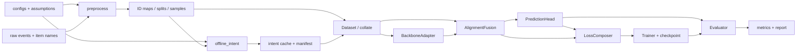

# Multi-view Intent Learning and Alignment with Large Language Models for Session-based Recommendation：Paper-Only 学习与工程复现指南

> 论文简称是 **LLM4SBR**。项目名和用户请求中的“LLM4RS”在本文中按论文正式简称 LLM4SBR 理解。

## 使用边界

- `[P] Paper`：来自当前 25 页论文 `2402.13840v2.pdf` 的正文、公式、图、表或脚注。论文包含参考文献，但没有独立 supplementary material。
- `[A] Assumption`：论文没有唯一规定、为得到可运行 PyTorch clean-room baseline 而作的选择。所有关键选择统一登记为 A1…A24。
- `[I] Inference`：由论文规格或假设推导出的解释，不等于作者明确陈述。
- `[E] Experiment`：只保留给未来实际运行的复现测试；本指南没有运行模型训练，因此没有把任何计划写成 `[E]`。
- 当前目录虽有一个 `LLM4SBR-main` 代码目录，但按本任务指定的 paper-only 协议，它未被阅读或用作作者实现 oracle。论文第 1 页声称公开代码 `[P]`，但本指南仍只从论文建立规格。
- 论文把 SR-GNN、GRU4Rec、SASRec 等作为可替换 backbone；本论文没有重述这些 backbone 的完整公式 `[P]`。因此本指南能够精确约束 LLM4SBR 的新增层与接口，却不能仅凭这篇论文重建每个引用模型的全部内部行为。

正确性声明：本指南描述的是“在 A1…A24 下，满足论文公开数学规格、数据约束和实验协议的 paper-constrained clean-room reproduction”。它不能证明与作者私有运行环境、未公开预处理或任何现有代码逐行一致。

## 60 秒全景

**任务。** 给定匿名会话前缀 \(s=[i_1,\ldots,i_L]\)，预测下一次点击 \(y=i_{L+1}\)。普通 SBR 只看稀疏 ID 行为；LLM4SBR 额外用物品名称的文本语义推断“长期意图”和“短期意图” `[P, §3–4]`。

**两阶段核心。** 阶段 1 离线完成：将同一会话写成长期/短期两个 prompt，调用 LLM，使用 BERT 把回答和全物品名称编码，再用 Top-\(r\) 余弦检索把可能幻觉的自由文本定位回真实物品空间。阶段 2 在线训练：SBR backbone 输出局部表示和全局表示；文本意图经线性变换进入同一隐空间，通过 alignment、uniformity 辅助损失约束表示，并作为门控信号融合局部/全局行为表示，最终对物品全集打分 `[P, Fig.1, Alg.1, Eq.(1)–(15)]`。

```text
原始有序交互 + 物品名
  ├─长期 prompt→LLM→BERT→Top-r 本地化→长期语义意图（离线缓存）
  ├─短期 prompt→LLM→BERT→Top-r 本地化→短期语义意图（离线缓存）
  └─ID 序列→SBR backbone→局部行为表示 + 全局行为表示
             语义意图→线性投影→分视角 alignment/uniformity
             行为表示 + 对应语义意图→两个标量门控→融合表示
             融合表示 × 候选物品表示→logits→Top-K / 推荐损失
```

五个 Unit 的关系是：先建立论文心理模型；随后先给完整工程系统地图；再依次固定数据合同、实现离线语义意图、实现表示对齐/融合与预测头，最后闭合损失、训练和评估。

## Unit 1：下一物品推荐、双视角语义意图与完整数学地图

### 1. 在整套系统中的位置

本单元把论文从输入一直连到输出，建立所有后续单元共享的符号、证据与边界。它的上游是原始会话和物品名；下游是工程化大框架。此处不决定 padding、缓存格式或 PyTorch 类名。

### 2. 要解决的问题与动机

SBR（session-based recommendation，会话推荐）面对匿名、短序列和稀疏交互。ID embedding 能学习协同模式，但名称不同、语义相近的物品初始没有联系 `[P, §1]`。论文的主张是：LLM 的文本理解可以补充潜在意图，但直接让 LLM 推荐又会遭遇候选越界、幻觉和训练成本高。因此作者把 LLM 推理从小模型训练中拆出去，并只在离线阶段使用 `[P, §1, §4.3]`。

这里有三层不能混淆：

1. “语义有帮助”是研究动机；表 3 的多数提升是支持它的经验观察，不是对任意数据集的证明。
2. “两阶段更轻量”指阶段 2 不需训练/运行 LLM；离线推理本身仍有成本。论文的 \(O(n)\) 分析把单条 prompt 长度视作常数 `[P, §5.5]`。
3. “plug-and-play”表示新增框架只要求 backbone 提供局部/全局表示；它不保证所有 backbone 都提升。表 3 中部分 GCE-GNN、\(S^2\)-DHCN 指标下降 `[P, Table 3]`。

### 3. 通俗机制与最低前置知识

- **会话前缀**：已经发生的一串点击；标签是紧随其后的一个物品。
- **embedding**：把离散 ID 或文本变成可计算相似度的实数向量。
- **局部/短期**：最后点击附近的偏好；论文以最后点击物品作为 SR-GNN 的局部表示 `[P, §4.2.1]`。
- **全局/长期**：聚合整段会话的偏好；论文原型用 SR-GNN 的软注意力聚合 `[P, §4.2.1]`。
- **alignment**：让同一会话、同一视角的文本向量与行为向量接近。
- **uniformity**：避免所有会话表示坍缩到同一点，鼓励不同样本铺开。
- **logit**：softmax 之前的任意实数分数；概率是沿候选物品轴 softmax 后的值。

### 4. 论文规格、贡献地图与数据流

| 贡献 | 解决的缺口 | 依赖关系 | 论文依据与边界 |
|---|---|---|---|
| 双视角 prompt | 单个宽泛 prompt 缺少长期/短期方向 | 需要物品名和有序 ID | `[P, Fig.2–3, §4.1.1–4.1.2]`；视角可扩展是设计主张，不是已验证任意视角 |
| intent localization | LLM 回答可能是模糊词或目录外物品 | 依赖 BERT 物品库与 Top-\(r\) 检索 | `[P, Eq.(2)–(5)]`；并非让 LLM二次 RAG 生成，而是直接形成加权物品向量 `[I]` |
| 分视角对齐与均匀 | 文本空间和 SBR 隐空间不一致 | 依赖 SBR 的 local/global 输出和投影 \(T\) | `[P, Eq.(7)–(9)]`；采样和 reduction 未完整规定 |
| 语义门控融合 | 把语义信号注入最终行为表示 | 依赖短期↔local、长期↔global 对应 | `[P, Eq.(10)–(12)]`；文本向量不是直接拼入最终表示 `[I]` |
| 可替换 backbone/LLM | 减少对单一模型的绑定 | 需要稳定 adapter contract | `[P, §4.3, Table 3]`；不同 backbone 的内部定义来自各自论文，不在当前材料内 |

完整训练数据流：一个前缀样本产生两个离线语义向量；同一前缀在线产生 \(h^l,h^g\)；短期语义与 \(h^l\) 对齐并产生短期门控，长期语义与 \(h^g\) 对齐并产生长期门控；融合后的 \(h^{sess}\) 对全物品打分；推荐损失和两个视角的辅助损失共同更新阶段 2 参数。推理时消失的支路是 alignment/uniformity loss、反向传播和优化器；离线 LLM/BERT 不在每个 batch 内运行 `[P+I]`。

### 5. 数学地图与 tensor contract

设 \(B\) 为 batch，\(L\) 为 padding 后长度，\(N\) 为候选物品数，\(d_t\) 为 BERT 文本维，\(d\) 为 SBR 隐维，\(r\) 为语义近邻数。

| 公式组 | 目的 | 单样本 → batch shape | 关键轴/运算 | 输出与梯度 |
|---|---|---|---|---|
| Eq.(1) | 两视角自由文本推断 | prompt 字符串 → `list[str]` 长度 B | LLM 生成，不是 tensor | 文本回答；阶段 2 无梯度 `[P]` |
| Eq.(2)–(3) | 编码回答与物品名 | \([d_t]\), \([N,d_t]\) → \([B,d_t]\), \([N,d_t]\) | BERT pooling 未说明 A7 | 缓存 float 向量，无训练梯度 |
| Eq.(4)–(5) | 目录内意图定位 | 相似度 \([N]\) → \([B,N]\)；Top-r 索引 \([B,r]\) | 余弦沿 \(d_t\)，Top-r 沿 N，gather 后加权 sum 沿 r | \(h^{p}_{infer}\in[B,d_t]\)；是否归一化未说明 A8 |
| Eq.(6) | 行为编码 | \([L]\) → `([d],[d])`；batch 为 \([B,L]\) → 两个 \([B,d]\) | backbone 特定；mask 必须排除 PAD | \(H^l,H^g\)，接收所有阶段 2 loss 梯度 |
| Eq.(7)–(9) | 分视角对齐/均匀 | \([B,d_t]@[d_t,d]\to[B,d]\) | alignment 对 feature 求平方和、对 B 求均值；uniformity 的 pair/reduction 有歧义 A13 | 标量 \(L_a,L_u\)，更新 T、backbone |
| Eq.(10)–(12) | 语义门控与融合 | 四个 \([B,d]\) → 两个 \([B,1]\) → \([B,d]\) | sigmoid 沿元素；\(Q^T\) 沿 d 得标量；concat 沿 feature | \(H^{sess}\)，梯度到 W/Q/T/backbone `[P+I]` |
| Eq.(13) | 全目录打分 | \([d]\cdot[N,d]^T\to[N]\)；batch \([B,d]@[d,N]\to[B,N]\) | softmax 沿 N | logits/probabilities；候选 embedding 是否 tying 为 A16 |
| Eq.(14)–(15) | 联合优化 | target \([B]\) 或 one-hot \([B,N]\) | 文字称 CE，式子是 softmax 后逐项 BCE：高影响矛盾 A17 | 标量 \(L=L_r+\tau(L_a+L_u)\) |

关键符号表：

| 符号 | 语义 | 工程 shape |
|---|---|---|
| \(s_t\), \(I_t\) | 第 t 个会话有序点击；论文 Eq.(6) 用集合符号但顺序对 local 很重要 | `item_ids[B,L]`, long |
| \(y,\hat y\) | 下一物品标签；预测分布 | `target[B]`; `probs[B,N]` |
| \(E_{item}\) | 所有物品名的冻结文本向量 | `[N,d_t]`, float32 |
| \(h^{st}_{infer},h^{lt}_{infer}\) | 本地化后的短/长期文本意图 | `[B,d_t]`；投影后 `[B,d]` |
| \(H^l,H^g\) | 局部/全局行为表示 | `[B,d]` |
| \(T,Q_1,Q_2,W\) | 文本投影、两个门控向量、融合矩阵 | `[d,d_t]`, `[d]`, `[d]`, `[d,2d]`（按 PyTorch `Linear` 权重方向写） |
| \(V\) | 候选物品表示 | `[N,d]` |

### 6. 完整 worked example：同一个非对称会话贯穿全文

定义 5 个物品：1“红茶”、2“咖啡豆”、3“茶壶”、4“跑鞋”、5“绿茶”。会话前缀为 `[1,2,1,3]`，标签为 5。重复 1、末项 3 和目标 5 故意不对称，可暴露“去重后丢顺序”“最后一列当最后有效项”和方向错误。

阶段 1：长期 prompt 可能回答“绿茶”，短期 prompt 可能回答“茶具”。本地化把自由文本投到真实物品向量附近。阶段 2：backbone 读 `[1,2,1,3]`，局部表示来自物品 3，全局表示聚合整段；短期“茶具”门控局部分量，长期“绿茶”门控全局分量；融合向量对 5 个候选打分，目标列必须是 class 5 对应的内部索引。这个例子不是声称 LLM 必然产生上述回答，而是 A6 下的 deterministic fixture。

### 7. 工程映射

```text
raw events ──preprocess──> CanonicalSample
item names + prompts ──offline_intent──> IntentCache
CanonicalBatch ──backbone adapter──> BehaviorViews(local, global)
IntentCache + BehaviorViews ──alignment_fusion──> ModelOutput(logits, aux tensors)
ModelOutput + target ──losses/metrics──> train/eval evidence
```

核心对象应使用带字段名的 dataclass/dict，避免返回位置不明的 tuple：`CanonicalBatch`、`IntentBatch`、`BehaviorViews`、`ModelOutput`。

### 8. 初始“论文已规定 / 未规定”清单

| 已规定 `[P]` | 未规定，必须是假设 |
|---|---|
| 两视角 prompt；物品由 `序号+名称+ID` 构成 | LLM decoding、温度、seed、失败重试、最大上下文 |
| BERT-base-uncased 编码回答和物品名 | CLS/mean pooling、token 截断、是否 L2 normalize 后保存 |
| 余弦 Top-r 加权和，初始 r=5 | 权重是否截断负数、softmax/和归一化、tie-breaking |
| backbone 输出 local/global，原型 SR-GNN | 每个 backbone 的完整实现和适配细节 |
| d=100、batch=100、tau=0.1 | T 是否跨视角共享；dropout、初始化、bias |
| Adam lr=0.001，3 epoch 衰减 0.1，L2=1e-5 | epoch、early stopping、seed、clip、AMP、validation |
| Beauty 与 ML-1M 的部分过滤、分段和统计 | train/test 切分方法、过滤先后、重复交互、validation |
| P/MRR/NDCG@5/10/20 | full-catalog/sampled、已见物品过滤、tie-breaking、精确公式 |

### 9. 注意事项、静默 bug 与检测

| 错误 | 为什么诱人 | 后果 | 最小检测 |
|---|---|---|---|
| 把会话当集合 | 论文 Eq.(6) 写 \(I_t\subseteq I\) | 重复/顺序消失，local 错 | `[1,2,1,3]` 与 `[1,1,2,3]` 的 global 可不同，local 同为 3 |
| 将文本直接拼进最终表示 | Fig.1 视觉上像融合 | 与 Eq.(12) 的门控语义不同 | 断言最终输入是两个 d 维加权行为向量，concat 为 2d |
| 把概率当 logits 再 softmax | Eq.(13) 同时写 score/softmax | loss 梯度与数值错误 | 单测 `cross_entropy(logits)`，禁止对 `probs` 再 CE |
| 只看 shape 忽略视角对应 | long/short 都是 `[B,d]` | long 错门控 local，仍可训练 | 给两个视角完全不同的 one-hot fixture，分别置零检查 |
| 把论文结果写成复现 `[E]` | 表 3 有具体数值 | 混淆论文证据与本地证据 | 报告中论文表只标 `[P]`，命令输出才标 `[E]` |

### 10. 本单元产出与结论边界

产出是一个完整因果链、公式分组、shape 主干和证据边界。论文表 3 支持“多数被测 backbone/指标提升”，表 4 支持完整框架优于所列消融，图 6 支持双视角在两个数据集上均有价值，图 7 支持 \(r\in[1,5]\) 的效果相近且 r=0 多数较差 `[P]`。这些结果不能确定未公开实现选择，也不能推出所有 SBR 模型、数据集或 LLM 都会提升。

## 工程化大框架（组件实现前置章）

### 1. 论文特定的七层分层

| 层 | 负责 | 不负责 | 未来文件 |
|---|---|---|---|
| 入口与配置 | 解析 `prepare-intents/train/evaluate`；装载 A#；记录环境 | 不隐藏默认值，不做张量算法 | `src/cli.py`, `configs/*.yaml` |
| 离线预处理与静态产物 | 会话化、过滤、ID 映射、prompt、LLM/BERT、Top-r、缓存 manifest | 不参与每 batch 梯度；不读取 test 建训练统计 | `src/preprocess.py`, `src/offline_intent.py` |
| 运行时数据管线 | 按 sample_id 联结序列/标签/两视角缓存；padding/mask | 不重新调用 LLM/BERT | `src/data.py`, `src/collate.py` |
| 模型与表示模块 | backbone adapter、文本投影、门控融合、候选打分 | 不定义 split 和 metric | `src/backbones/`, `src/alignment_fusion.py`, `src/model.py` |
| 目标函数 | recommendation/alignment/uniformity 和加权组合 | 不更新 optimizer | `src/losses.py` |
| 训练编排与持久化 | seed、train state machine、validation、checkpoint | 不改变数据语义 | `src/train.py`, `src/checkpoint.py` |
| 评估与报告 | 确定性排序、P/MRR/NDCG、聚合、结果/假设清单 | 不调 test 超参 | `src/metrics.py`, `src/evaluate.py`, `reports/` |

LLM 在线服务层在阶段 2 **不需要**；它只属于离线静态产物生成。这样既匹配论文两阶段结构，也让训练结果可审计。

### 2. 模块职责与依赖方向



依赖规则：`data` 不导入 `model`；backbone 只依赖标准 batch contract；`losses` 消费 `ModelOutput` 而不调用 Dataset；`metrics` 不导入 optimizer。离线依赖以实线到缓存结束；每 batch 在线路径从 Dataset 开始；Evaluator 仅在评估出现。

共享对象的所有权：`id_map` 由 preprocess 创建；`IntentCache` 由 offline_intent 创建且只读；可学习 item embedding 由 backbone/head 拥有；optimizer/scheduler 由 Trainer 拥有；metric accumulator 由 Evaluator 拥有。

### 3. 端到端训练调用链

1. `cli train --config ...` 读取配置和 A#，建立 run directory；调用者是入口，输出 resolved config。
2. `seed_everything` 固定 Python/NumPy/PyTorch 和 sampler seed；状态从“未初始化”变为“可复现运行”。
3. DataModule 校验 split manifest、ID-map 哈希、intent-cache 哈希；任何 sample_id 缺失立即失败。
4. Dataset 取 `item_ids,target,short_intent,long_intent`；collate 生成 padding、lengths、valid mask。
5. `LLM4SBR.forward` 调 backbone 得 `local/global`，投影两种意图，产生两个 gate、融合表示和 `[B,N]` logits。
6. `LossComposer` 计算推荐损失；训练阶段额外从同 batch 或显式 pair sampler 计算两个视角的 alignment/uniformity。
7. Trainer 执行 `zero_grad(set_to_none=True) → autocast(A22) → forward → loss → backward → clip(A21) → optimizer.step → scheduler.step(按 epoch)`。
8. Validator 切到 `eval()` 和 `no_grad()`，禁用随机数据变化；聚合 validation 指标。
9. model-selection 依据 A20 保存 `model/optimizer/scheduler/epoch/best_metric/RNG/config/id_map_hash/cache_hash`。
10. 日志写出 loss 分量、梯度范数、学习率、吞吐和所有 A#。训练专属部分是随机 pair、aux loss、autograd、optimizer、scheduler 和 checkpoint 更新。

### 4. 独立推理与评估调用链

`evaluate` 读取 frozen config → 恢复 checkpoint 并核对映射/缓存哈希 → 构造确定性 eval batch → 只运行 backbone、投影/门控/融合和打分 → 按 A18 过滤候选 → 稳定 Top-K 排序 → 每个样本产生推荐 ID/score → metric accumulator 在整个 split 上计算 P/MRR/NDCG → 写 JSON/CSV/report。

推理中没有 LLM API、随机增强、pair sampler、aux loss、`backward()`、optimizer 或 scheduler。单样本推理输出是一个排序列表；数据集评估指标是许多样本统计的聚合，二者必须分开存储。

### 5. 论文概念/公式到工程模块总映射

| 论文对象 | 来源 | 模块/函数 | 输入 → 输出 | 深入单元 |
|---|---|---|---|---|
| 问题定义 | `[P, §3]` | `CanonicalSample` | prefix → target | 2 |
| Fig.2 prompt | `[P]` + A6 | `build_prompt` | names/ids/view → str | 2/3 |
| Eq.(1) | `[P]` + A5 | `LLMClient.generate` | str → answer | 3 |
| Eq.(2)–(3) | `[P]` + A7 | `TextEncoder.encode` | text → `[d_t]` | 3 |
| Eq.(4)–(5) | `[P]` + A8–A10 | `IntentLocalizer` | query/catalog → intent | 3 |
| Eq.(6) | `[P]` 接口 + A12 | `BackboneAdapter.forward` | IDs/mask → views | 4 |
| Eq.(7)–(9) | `[P]` + A13–A15 | `AlignmentUniformity` | text/behavior views → losses | 4/5 |
| Eq.(10)–(12) | `[P]` + A14 | `MultiViewFusion` | four `[B,d]` → `[B,d]` | 4 |
| Eq.(13) | `[P]` + A16/A18 | `CatalogHead` | session → logits | 4 |
| Eq.(14)–(15) | `[P]` + A17 | `LossComposer` | output/target → scalar | 5 |
| Table 2 protocol | `[P]` + A1–A4 | `preprocess` | raw → splits | 2 |
| P/MRR/NDCG | `[P]` 名称 + A18/A19 | `metrics` | ranks → aggregates | 5 |

### 6. 跨层 tensor 与接口交接

| 提供方 → 消费方 | 对象 | shape / dtype / device | ID、mask 与阶段差异 | 证据 |
|---|---|---|---|---|
| preprocess → Dataset | prefix/target/sample_id | variable list[int], int, str；CPU | internal item 1..N，PAD=0 A3；所有阶段相同 | `[P]+A3` |
| cache → Dataset | short/long intent | `[d_t]` float32 CPU | sample_id 严格联结；训练/评估均冻结 | `[P]+A10` |
| collate → backbone | item_ids/mask/lengths | `[B,L]` long, `[B,L]` bool, `[B]` long；送 device | `mask=True` 表示有效 A4；不得用 padded 最后一列 | A4 |
| backbone → fusion/loss | local/global | 两个 `[B,d]` float device | local 对 short，global 对 long | `[P]` |
| projector → fusion/loss | projected intents | 两个 `[B,d]` float device | 使用同一 T A14；缓存本身无梯度 | `[P]+A14` |
| fusion → head | session | `[B,d]` float device | train/eval 仅 dropout 状态可能不同 A15 | `[P]+A15` |
| head → loss/metrics | logits | `[B,N]` float device | 第 j 列对应 internal item `j+1`；PAD 无候选列 | `[I]+A16` |
| Dataset → loss | target | `[B]` long device | class 0..N-1=`item_id-1`，只转换一次 | A3/A17 |
| metrics → report | sums/counts | float64 CPU | eval-only；跨 batch 聚合后才除分母 | A19 |

### 7. 全系统状态与生命周期

| 状态 | 创建时机 | device/grad | 是否保存 | 训练/推理共享 |
|---|---|---|---|---|
| resolved config、A# | 入口 | CPU/no-grad | run artifact | 是 |
| ID maps、split manifest | preprocess | CPU/no-grad | 静态文件+hash | 是 |
| item text embeddings | offline 初始化 | 可暂上 GPU/no-grad | cache | 是 |
| per-sample intent cache | offline intent | CPU/no-grad，batch 时搬运 | cache+manifest | 是 |
| T/Q/W、backbone、item params | model init | device/grad | checkpoint | 是 |
| batch tensors | collate | CPU→device；输入无 grad | 否 | 是，但 sampling 不同 |
| optimizer/scheduler/RNG | train init | 混合 | checkpoint | 推理不需要 |
| logits/aux intermediates | forward | device/grad in train | 通常不保存 | eval 无 grad |
| metric accumulators | eval | CPU/no-grad | 最终 JSON | eval-only |

特别容易混淆：缓存的 BERT/意图向量是输入静态特征，不是可学习参数；候选 item embedding 是参数；Top-r 索引是离线派生数据；gate 是每个样本的运行时标量，不是全局超参数。

### 8. 依赖驱动的实现顺序与最小纵向切片

完整顺序：规格与 A# → 非对称 tiny fixture → preprocess/ID/mask contract → deterministic intent cache（先绕过真实 LLM）→ 最小 backbone adapter → 投影/门控/head → losses/metrics → trainer/evaluator → tiny overfit → 真实离线 LLM/BERT → 小数据 → bounded reproduction。

第一个可运行纵向切片只含 5 个物品、2 个样本、手写两视角意图、一个确定性 toy backbone。它应能输出 `[2,5]` logits、三个 loss 分量、Top-3 排名和有限梯度。它不证明论文指标，但一次贯通所有接口，能最早发现 ID 偏移、视角接反和 loss 不可微。

每步解除的依赖：fixture 固定期望值；数据层固定语义；toy backbone 固定 adapter；完整 forward 固定梯度路径；loss/metric 固定优化与报告；tiny overfit 验证连通性；真实 stage 1 只替换 cache 生产者，不改变训练 API。

### 9. 框架级未知项与变更点

- A1/A2 改变 split 与样本数量，会使缓存 key、报告和所有指标失效，必须整链重建。
- A7–A10 改变文本向量或本地化，会使缓存 manifest 版本变化，但不改模型 API。
- A12 改 backbone，可能改变 global/local 定义，但 adapter 输出 contract 不变。
- A13/A17 改 loss 语义，会改变梯度与复现结论，必须单独配置和报告。
- A16/A18 改候选/tying，会改变 head 参数、logits 列空间和 metrics，不可在训练后静默切换。
- A20 改 model-selection，需要重新解释 test 结果，不能复用“best checkpoint”标签。

## Unit 2：Beauty / ML-1M 会话化、ID 空间与可执行数据协议

### 1. 在整套系统中的位置

本单元放大工程大框架的“离线预处理”和“运行时数据管线”。上游是原始 ratings/interactions 与物品名称；输出是唯一的 `CanonicalSample`、split manifest、ID 映射和 batch contract。Unit 3 只能读取这些对象生成意图缓存，Unit 4 只能消费 batch，不得自行解释原始文件。

### 2. 要解决的问题

如果不先固定数据协议，模型即使 shape 正确也可能预测错一列、把未来点击放进 prompt、用 test 物品统计建图，或把 padding 当合法物品。论文给出了部分清洗与统计，却未给 split、时间排序、validation 和完整文件 schema；这些必须显式成为假设，而不能由“常见做法”补成 `[P]`。

### 3. 通俗机制：一条原始历史如何变成监督样本

会话推荐把“已发生”与“下一次”切开。例如用户历史 `[1,2,1,3,5]` 产生输入 `[1,2,1,3]` 和标签 5。Beauty 论文明确采用前缀扩展：长度 n 的序列产生 n-1 个 `(prefix,next)` 对 `[P, §5.1.1]`。ML-1M 先按用户和时间排序，相邻评分间隔超过 10 分钟就开启新会话 `[P]`；论文 §5.4 又说 ML-1M 没有使用 sequence segmentation augmentation，因此 A2 首版让每个会话只产生“前 n-1 项 → 最后一项”一个样本。

**泄漏边界。** 某个样本的 prompt 只能含 prefix，不含 target；item name table 可以是全目录固有元数据，但 split、图边、流行度或负采样统计不得读取未来标签。论文写“删除所有会话中频次少于 5 的物品” `[P]`，可能使用全量统计；A1 提供 `paper_literal` 和 `train_only_safe` 两个命名模式，并要求报告差异。

### 4. 论文数据规格

| 项目 | Beauty | ML-1M | 证据/缺口 |
|---|---|---|---|
| 来源 | Amazon Beauty evaluations/ratings | MovieLens-1M ratings | `[P, §5.1.1]`；具体快照日期未给 A1 |
| 会话定义 | 单用户全部评分序列视为一个会话 | 同用户相邻交互 >10 分钟切新会话 | `[P]`；同 timestamp 排序未给 A2 |
| 样本增强 | 所有非空前缀 | 未用该分段增强 `[P, §5.4]` | ML-1M 的目标构造仍不够明确 A2 |
| 过滤 | 删除长度 1 会话；删除全会话频次 <5 物品 | 同左 | `[P]`；执行次序、是否迭代未给 A1 |
| 报告统计 | Train 158,139；Test 18,000；Clicks 198,502；Items 12,101；Avg.len 8.66 | Train 47,808；Test 5,313；Clicks 987,610；Items 3,416；Avg.len 17.59 | `[P, Table 2]`；这些是预处理核对目标，不是任意版本的保证 |
| 文本字段 | beauty item name | movie title/genre（图 8 示例） | `[P, Fig.3/8]`；缺失名处理未给 A6 |

### 5. Canonical schema 与 tensor contract

静态样本建议保存为 Parquet/JSONL 均可，语义必须一致：

| 字段 | 单样本语义/类型 | batch shape | 约束 |
|---|---|---|---|
| `sample_id` | 稳定字符串 | `list[str]` 长 B | 由 dataset/split/session/prefix_end 构成，不含随机 hash |
| `session_id` | 原会话稳定 ID | `list[str]` | split 以它为分组单位，避免同一原会话跨 split A2 |
| `item_ids` | prefix 的 internal IDs，`list[int]` | `[B,L]` long | 顺序、重复保留；合法范围 1..N；0 仅 PAD A3 |
| `length` | 未 padding 长度 | `[B]` long | 等于 `mask.sum(1)`，且 ≥1 |
| `target_item_id` | 下一物品 internal ID | `[B]` long | 1..N；不能出现在 prompt 的未来位置 |
| `target_class` | head 列索引 | `[B]` long | `target_item_id-1`，范围 0..N-1 A3 |
| `valid_mask` | 真实 token 为 True | `[B,L]` bool | A4 固定右 padding；所有 attention/gather 共用同一语义 |
| `short_intent`,`long_intent` | cache 中冻结语义向量 | 各 `[B,d_t]` float32 | sample_id、encoder/r/prompt 哈希必须吻合 A10 |

`raw_id ↔ internal_id ↔ target_class` 是三个空间。PAD 没有 target class；真实物品 1 对应 class 0。任何转换只在 preprocess/head 边界各做一次。

### 6. 完整 worked example：从记录到 batch

样本 A 的原记录按时间是 `[(1,红茶),(2,咖啡豆),(1,红茶),(3,茶壶),(5,绿茶)]`。前缀终点设在第 4 次点击，得到：

```python
CanonicalSample(
    sample_id="toy/train/s0/p4",
    session_id="s0",
    item_ids=[1, 2, 1, 3],
    target_item_id=5,
    target_class=4,
)
```

另一个样本 B 是 prefix `[2,4]`、target item 1。A4 右 padding 后：

```text
item_ids = [[1,2,1,3],
            [2,4,0,0]]          shape [2,4], int64
mask     = [[T,T,T,T],
            [T,T,F,F]]          shape [2,4], bool
lengths  = [4,2]
targets  = [4,0]                class space, not item-ID space
```

最后有效物品必须用 `item_ids[arange(B), lengths-1]` 得到 `[3,4]`；直接取最后一列会得到 `[3,0]`，shape 完全正常但第二个 local 表示错误。交换 batch 两行后，所有输出也应只交换两行。

### 7. 工程映射与接口

```python
def build_sessions(raw_events, dataset_cfg) -> list[RawSession]: ...
def filter_and_split(sessions, split_cfg) -> SplitManifest: ...
def build_examples(manifest, expansion_mode) -> list[CanonicalSample]: ...
def build_id_map(train_or_all_items, id_cfg) -> IdMap: ...
def collate(samples: list[JoinedSample]) -> CanonicalBatch: ...
```

文件职责：`preprocess.py` 只处理排序、会话化、过滤、split、ID 和样本；`data.py` 只读取已固定 artifact 并按 sample_id 联结 cache；`collate.py` 只 padding/搬运；`sampling.py` 只在 A18 选择 sampled evaluation 或训练负采样时存在，首版 full-catalog 不需要它。

推荐 artifact：`metadata.json` 记录原始文件 hash、规则、计数；`id_map.json`；`train/valid/test.jsonl`；`item_text.jsonl`；`split_manifest.json`。代码不得从文件名猜 split。

### 8. 假设与备选方案

- **A1 数据版本与过滤。** 首版固定本地数据文件 hash；`paper_literal` 先会话化、反复删除 `<5` 物品和 `<2` 会话至稳定，再按 A2 split。备选 `train_only_safe` 只从训练数据拟合物品表/频次并丢弃 valid/test unseen；两者的统计与指标分开报告。
- **A2 排序、split 与样本化。** 同用户按 `(timestamp, original_row)` 稳定排序；按 session 分组做 chronological 80/10/10，Beauty 对每个 split 内会话展开前缀，ML-1M 每个会话取最后一项为 target。备选是论文 Table 2 对应的未知官方 split；若拿到明确 split 文件，应替换 A2 而非混合。
- **A3 ID。** PAD=0，物品=1..N，target class=ID-1。备选是统一 0..N-1 再给 PAD 独立列；更容易误把 PAD 纳入候选。
- **A4 batch。** 右 padding，`True=valid`，不排序、不 pack。备选左 padding；会改变 local gather 和位置约定。
- **A6 文本。** 名称缺失时用显式 `[MISSING_ITEM_NAME]_<raw_id>`，prompt 使用论文英文模板并要求只输出名称；ML-1M 以 `title -- genres` 为名称。备选只用 title，做敏感性实验。

### 9. 确定性验证与易错点

| 错误 | 后果 | 最小检测与修正 contract |
|---|---|---|
| 过滤后不重新检查会话长度 | 产生空 prefix/无标签 | 固定点过滤；断言每个 sample `len(prefix)>=1` |
| 同一 session 的不同 prefix 跨 split | 近重复泄漏 | split `session_id` 集合两两不交 |
| prompt 含 target 名称 | LLM 直接看到答案 | 保存 prompt source indices，最大 index 必须 `< target_position` |
| raw ID 直接进 embedding | 稀疏/越界或巨大表 | 对 tiny fixture 检查 ID 双向可逆且连续 |
| PAD 与 item 0 冲突 | 推荐候选错位 | 断言 head 无 PAD 列，target 从不为 0 item-ID |
| 全 batch 最后一列作为 local | 短样本读取 PAD | 用上述 `[4,2]` lengths fixture |
| 先 padding 再数非零但真实 ID 可为 0 | length 错 | A3 保证真实 ID 从 1 开始，并保存原 length |
| 用 test 选择频次/图但未声明 | 指标偏乐观 | metadata 标 `vocab_fit_scope`；同时跑 A1 两模式 |

确定性测试还包括：原始→internal→raw 可逆；相同样本重复 collate 完全相同；交换 batch 行只交换输出；额外右 PAD 不改变真实 `length/mask/target`；缓存每个 split 恰好一对视角、无孤儿 key。

### 10. 本单元对复现的产出

产出为 `src/preprocess.py`、`src/data.py`、`src/collate.py`、`tests/test_data.py`、`fixtures/tiny_sessions.jsonl`、`configs/data_baseline.yaml` 以及带 hash 的数据 manifest。通过条件不是“loss 能下降”，而是所有中间对象与 tiny fixture 手算一致，Table 2 的统计差异能被 A1/A2/数据版本解释并记录。

## Unit 3：双视角 Prompt 与 Top-r 意图本地化的 clean-room 实现

### 1. 在整套系统中的位置

本单元实现阶段 1，消费 Unit 2 的 `item_text`、有序 prefix 和 sample_id，输出冻结的 short/long intent cache。它位于训练主循环之外；Unit 4 只看到两个 `[B,d_t]` 向量，不知道它们来自哪家 LLM。

### 2. 要解决的问题

自由文本回答可能是目录内精确名称、模糊类别或目录外物品。直接把回答当 item ID 会失败；直接把 BERT 回答向量传给小模型又可能保留幻觉。论文的 intent localization 用真实物品名称库作为锚点，把回答表示成 Top-r 真实物品文本向量的相似度加权和 `[P, Eq.(2)–(5)]`。

### 3. 本文最小前置知识

**文本 encoder。** BERT 接收 token 序列，输出 token hidden states。要把一句话变成 `[d_t]` 必须选 CLS 或 masked mean；论文只指定 `bert-base-uncased`，没指定 pooling，故 A7。

**余弦相似度。** 对非零向量 \(q,x\)，\(\cos(q,x)=q^Tx/(\|q\|\|x\|)\)。它看方向而不是长度。PyTorch 可先 `F.normalize(..., dim=-1)`，再矩阵乘。

**Top-k/gather。** `scores[B,N].topk(r,dim=1)` 返回每行最高 r 个分数和索引；用索引从 `catalog[N,d_t]` gather 成 `[B,r,d_t]`。加权 sum 的轴是 r，绝不能沿 feature 轴 d_t。

### 4. 论文规格

长期和短期 prompt 都包含：点击顺序编号、物品名称、唯一 ID、视角限定词和“只输出物品名”的任务要求 `[P, Fig.2–3]`。Eq.(1) 调 LLM；Eq.(2)–(3) 用 BERT 编码回答和物品名；Eq.(4) 计算每个回答对所有物品的余弦；Eq.(5) 取 Top-r，按原始 cosine 加权求和 `[P]`。实验以 Qwen-7B-Chat、BERT-base-uncased、初始 r=5；图 7 比较 r=0/1/3/5 `[P, §5.1.3/5.4]`。

论文符号在 Eq.(4) 中混用 \(i,j\)：工程化后应写为

\[
s_{b,j}=\frac{q_b^T e_j}{\|q_b\|\|e_j\|},\quad
J_b=\operatorname{TopR}_j(s_{b,j}),\quad
h_b=\sum_{j\in J_b}s_{b,j}e_j.
\]

这是对公式索引的消歧 `[I]`，不是新算法。

### 5. 公式到 tensor contract

| 字段 | contract |
|---|---|
| 论文位置 | Fig.2–4，Eq.(1)–(5)，Algorithm 1 第 1–7 行 |
| 输入语义 | B 个同视角回答；N 个目录物品名称 |
| 单样本 / batch | query `[d_t]` / `[B,d_t]`；catalog `[N,d_t]`；scores `[N]` / `[B,N]` |
| dtype/device | token IDs long；attention mask bool/long；embedding float32；离线可 GPU，缓存回 CPU |
| 运算与轴 | BERT pooling 沿 token；normalize 沿 d_t；matmul 得 N；topk 沿 N；weighted sum 沿 r |
| 参数 | BERT 是否冻结论文暗示为预训练解析器但未直说，A7 固定冻结；此阶段不与 stage 2 联训 |
| 输出 | 每个 sample/view 一个 `[d_t]` intent；附 Top-r raw IDs/scores 供审计 A10 |
| 梯度 | 无 stage-2 梯度；缓存是常量。未来若端到端微调 BERT，将超出论文两阶段轻量边界 |
| 关键假设 | A5–A10 |

### 6. 完整 worked example：手算本地化

为便于手算，把 5 个目录物品的文本向量都设成二维单位向量：

```text
e1 红茶=(1,0)       e2 咖啡豆=(0,1)
e3 茶壶=(0.8,0.6)   e4 跑鞋=(-1,0)
e5 绿茶=(0.6,0.8)
```

长期回答“绿茶”的 query 取 \(q_{lt}=(0.6,0.8)\)。对 1…5 的 cosine 是 `[0.6,0.8,0.96,-0.6,1.0]`。当 fixture 的 r=2，Top-2 是物品 5 和 3：

\[
h_{lt}=1.0(0.6,0.8)+0.96(0.8,0.6)=(1.368,1.376).
\]

短期回答“茶具”的 query 取 \(q_{st}=(0.8,0.6)\)，scores 为 `[0.8,0.6,1.0,-0.8,0.96]`，Top-2 为 3 和 5：

\[
h_{st}=1.0(0.8,0.6)+0.96(0.6,0.8)=(1.376,1.368).
\]

两者只交换了偏重方向，恰好能检测 short/long 接反。注意输出范数大于 1：Eq.(5) 没有除以权重和。A8 baseline 严格保留这个行为；若实现成加权平均，会得到不同尺度，应作为命名备选而非静默“优化”。

### 7. PyTorch 模块设计

```python
class LLMClient(Protocol):
    def generate(self, prompts: list[str], *, view: str) -> list[str]: ...

class FrozenTextEncoder:
    @torch.inference_mode()
    def encode(self, texts: list[str]) -> Tensor:  # [M,d_t]
        ...

class IntentLocalizer(nn.Module):
    def forward(self, query: Tensor, catalog: Tensor, r: int):
        q = F.normalize(query.float(), dim=-1)
        e = F.normalize(catalog.float(), dim=-1)
        scores = q @ e.T                         # [B,N]
        top_scores, top_idx = scores.topk(r, dim=1)
        picked = catalog[top_idx]                # [B,r,d_t]
        intent = (top_scores[..., None] * picked).sum(dim=1)
        return intent, top_idx, top_scores
```

`offline_intent.py` 的调用顺序是：先一次编码 catalog；按 split/sample_id 生成两个 prompt；批量调用 LLM；保存原回答；编码回答；本地化；以原子分片写缓存；最后生成 manifest。缓存版本键至少包含原始数据 hash、id map hash、prompt template/version、LLM name、decoding config、BERT name/revision、pooling、r、weighting mode。

### 8. 假设与可替换实现

- **A5 LLM 可重复性。** 固定模型 revision、greedy decoding、temperature=0、top_p=1、最大新 token 64；保留原回答和错误状态。备选采样生成须多次运行并单独统计。
- **A6 prompt/text。** 使用论文图 2 英文模板、明确 view、只输出名称；按 Unit 2 处理缺失名。备选只给名称不带 ID，以及综合视角 prompt，作为消融。
- **A7 BERT。** `bert-base-uncased` 冻结，masked mean pooling（排除特殊/pad token），输出 float32，最大长度 64；备选 CLS pooling。论文只给模型名，pooling/revision 都不是 `[P]`。
- **A8 本地化权重。** baseline 采用原始 cosine 加权和、不 softmax、不除权重和；备选 `relu+renorm`、softmax-temperature、加权平均。
- **A9 Top-r 边界。** `r=min(config_r,N)`，分数相同按 internal item ID 升序稳定打破；若 r=0，直接使用原始 query 作为论文图 7 的 no-localization 分支。
- **A10 缓存。** 每个 prefix、每个 view 单独缓存，并保存 answer、intent、top IDs/scores、全部 hash。备选运行时生成被禁止，因为会破坏两阶段复现性和成本边界。
- **A11 失败策略。** LLM/BERT 调用最多重试 3 次；仍失败则让整个离线任务失败并保留错误清单，不用零向量或上一条回答静默顶替。备选的 sentinel intent 必须单独统计缺失率并做消融。

### 9. 不变量、静默 bug 与最小测试

| 错误 | 为什么 shape 仍可能正确 | 后果 | 检测 |
|---|---|---|---|
| `normalize(dim=0)` | `[B,d_t]` 不变 | 样本之间相互归一，batch composition 改结果 | 同一 query 单独/与其他 query 批处理结果必须相同 |
| topk 沿 feature 轴 | d_t≥r 时可运行 | 选的是维度而非物品 | 断言 top_idx `<N` 且对手算 scores 等于 `[5,3]` |
| gather 了归一化 catalog，却想复刻 Eq.(5) 原向量 | shape 相同 | 输出尺度改变 | 非单位 catalog fixture 同时检查相似度与加权对象 |
| softmax Top-r 分数 | 看似更稳定 | 悄悄把 A8 改成另一算法 | 对手算长期输出精确断言 `(1.368,1.376)` |
| 负 cosine 被纳入 | r 大时合法 | 可能反向抵消语义 | r=N fixture 记录；与 relu 备选做敏感性 |
| BERT 未 `eval()` | 无 shape 问题 | dropout 令缓存漂移 | 同文本重复编码 bitwise/容差相等 |
| cache 用行号联结 | shuffle 后仍有合法向量 | 意图属于另一样本 | 用 sample_id join，shuffle 前后向量归属不变 |
| prompt 含 target | 生成看似更准确 | 严重标签泄漏 | prompt 源位置审计，fixture 中禁止出现“绿茶”target |

其他测试：零向量显式失败或 clamp epsilon；r=1/2/N 边界；catalog 行置换后输出语义不变且 top ID 对应置换；长短 query 交换时两个缓存字段只交换；相同配置命中缓存，不同任一 hash 强制重建。

### 10. 本单元对最终复现的产出

产出为 `src/prompts.py`、`src/text_encoder.py`、`src/intent_localization.py`、`src/offline_intent.py`、`tests/test_intent_localization.py`、`fixtures/intent_tiny.json`、`configs/intent_baseline.yaml` 和版本化 intent cache。最先验证数学 fixture，再接真实 BERT，最后才批量调用 LLM；这样 LLM 的非确定性不会遮住 cosine/topk/gather 的基本错误。

## Unit 4：行为视角适配、分视角门控融合与端到端 Forward

### 1. 在整套系统中的位置

本单元消费 Unit 2 的 `item_ids/mask` 和 Unit 3 的两个冻结 intent，输出 `ModelOutput(logits, local, global, projected_intents, gates, session)`。它负责 Eq.(6)–(13) 的 forward；推荐/辅助 loss 的 reduction 留给 Unit 5。论文没有独立第二个 encoder，因此不虚构“机制 B”。

### 2. 要解决的问题与上下游

文本向量和 ID 行为向量来自不同表示空间，不能直接比较；短期/长期语义也应分别对应局部/全局行为。Unit 4 用 \(T\) 把文本从 \(d_t\) 投影到 \(d\)，用 adapter 统一各种 SBR backbone，再按视角产生两个 gate，融合行为表示并对候选物品打分 `[P, §4.2]`。

训练与推理 forward 本身相同；训练额外保留中间张量给辅助 loss，推理只需 logits/ranking。LLM 和 BERT 都不在这里。若换 backbone，只允许改变 `BackboneAdapter` 内部，不改变下游字段。

### 3. 本文最小前置知识：SR-GNN 接口而非完整复刻

论文对原型 SR-GNN 只说明：会话变成图，唯一物品是节点；GGNN 更新节点；最后点击物品表示作为 local；软注意力聚合节点作为 global `[P, §4.2.1]`。理解接口需知道：

- 图节点是会话内“唯一物品”，但还必须保存原序列到节点的 alias index，才能找回最后点击；重复点击不能丢失 local 定位。
- 有向边来自相邻点击，`1→2` 与 `2→1` 不等价；入/出邻接的归一化方向不能互换。
- 多图 batch 通常需要 block-diagonal/sparse batching 或逐图编码；这不等于 `[B,L,d]` 的普通序列 batch。
- soft attention 对有效节点归一化，padding 节点权重必须为 0。

当前论文没有提供 GGNN/attention 的具体方程，所以 paper-only 最小纵向切片先用 `ToyBackboneAdapter` 验证 LLM4SBR 新增层；bounded SR-GNN reproduction 必须把引用论文的独立规格作为新材料，或把实现细节全部登记为 A12。不能把一个任意 GNN 冒充作者 SR-GNN。

### 4. 论文规格与视角对应

Eq.(6) 输出局部 \(H_t^l\) 和全局 \(H_t^g\)。Eq.(7) 把文本意图投影为 \(\tilde h^p_{infer}=Th^p_{infer}\)。Eq.(10) 用长期文本与 global 相加后经 sigmoid、\(Q_1^T\) 得长期 gate；Eq.(11) 用短期文本与 local 得短期 gate；Eq.(12) 先分别缩放 local/global，再拼接并用 W 映射到 d 维 `[P]`：

\[
\alpha^{lt}=Q_1^T\sigma(h^g+z^{lt}),\qquad
\alpha^{st}=Q_2^T\sigma(h^l+z^{st}),
\]

\[
h^{sess}=W[\alpha^{st}h^l;\alpha^{lt}h^g].
\]

其中 \(z^p=Th^p_{infer}\) 是工程化消歧 `[I+A14]`：论文 Eq.(10)–(11) 写 \(H_{infer}\) 而没有明确波浪号，但相加要求它已经在 d 维空间。若直接使用原始 \(d_t\) 文本，除非 \(d_t=d\)，shape 不成立。

另一个细节：sigmoid 在 \(Q^T\) 之前，所以最终 \(\alpha\) 未必落在 `[0,1]`；称其“soft-attention”不等于公式包含 scalar sigmoid/softmax `[P+I]`。A15 baseline 按公式，不擅自再压缩。

### 5. 公式组 tensor contract

| 组 | 输入/参数 | batch 运算和轴 | 输出 | 梯度路径 |
|---|---|---|---|---|
| Backbone Eq.(6) | IDs `[B,L]`, mask `[B,L]`; backbone params | 顺序/图聚合必须屏蔽 PAD | local/global 各 `[B,d]` | 推荐+辅助 loss → backbone |
| Projection Eq.(7) | intents `[B,d_t]`; `Linear(d_t,d,bias=A14)` | matmul feature 轴 | `z_st,z_lt [B,d]` | aux+gate → T；cache 无梯度 |
| Gates Eq.(10)–(11) | 对应行为/文本 `[B,d]`; Q `[d]` | elementwise add/sigmoid；与 Q 内积沿 d | `[B,1]` | 推荐 loss → Q/T/backbone |
| Fusion Eq.(12) | weighted local/global | 标量广播 feature；cat dim=-1 得 `[B,2d]`; Linear→d | session `[B,d]` | 推荐 loss → W 及所有上游 |
| Head Eq.(13) | session `[B,d]`, V `[N,d]` | `session @ V.T`，候选轴 N | logits `[B,N]`; softmax 仅展示/推理 | 推荐 loss → session/V |

mask contract：`True=valid`；local 用 `length-1`；global 的所有 normalize/softmax 只在有效位置/节点上。candidate contract：PAD 不在 V；target class 与 V 行完全一致。

### 6. 完整 worked trace

沿用 Unit 3 的 \(z_{st}=(1.376,1.368)\)、\(z_{lt}=(1.368,1.376)\)，令 toy backbone 为会话 `[1,2,1,3]` 输出：

```text
h_local=(0.2,0.8)       h_global=(0.9,0.1)
Q1=(1,0)                Q2=(0,1)
```

长期 gate 取 `sigmoid(h_global+z_lt)` 的第一维：\(\alpha^{lt}=\sigma(2.268)\approx0.906\)。短期 gate 取 `sigmoid(h_local+z_st)` 的第二维：\(\alpha^{st}=\sigma(2.168)\approx0.897\)。于是：

```text
weighted_local  ≈ (0.179, 0.718)
weighted_global ≈ (0.815, 0.091)
concat          ≈ (0.179, 0.718, 0.815, 0.091)  shape [4]
```

令 fixture 的 W 分别把同一 feature 的 local/global 相加，即
`W=[[1,0,1,0],[0,1,0,1]]`，则 \(h^{sess}\approx(0.995,0.808)\)。候选向量依次为
`[(1,0),(0,1),(0.6,0.4),(-1,0),(0.8,0.9)]`，logits 约为：

```text
item:     1      2      3       4      5
logit:  0.995  0.808  0.920  -0.995  1.523
```

目标 item 5（class 4）排第 1。这个 trace 同时检查：short→local、long→global、concat 顺序、W 方向和候选列偏移。任一处交换都会得到不同中间值。

### 7. PyTorch 模块树与 forward

```text
LLM4SBRModel
├── backbone: BackboneAdapter
├── intent_projector: Linear(d_text, d)
├── fusion: MultiViewFusion(Q_short, Q_long, Linear(2d,d))
└── head: CatalogHead(item_matrix or output_embedding)
```

```python
def forward(self, batch: CanonicalBatch) -> ModelOutput:
    views = self.backbone(batch.item_ids, batch.valid_mask, batch.lengths)
    z_st = self.intent_projector(batch.short_intent)
    z_lt = self.intent_projector(batch.long_intent)
    a_st = (torch.sigmoid(views.local + z_st) * self.q_short).sum(-1, keepdim=True)
    a_lt = (torch.sigmoid(views.global_ + z_lt) * self.q_long).sum(-1, keepdim=True)
    session = self.fuse(torch.cat([views.local * a_st,
                                   views.global_ * a_lt], dim=-1))
    logits = self.head(session)                 # [B,N], no softmax here
    return ModelOutput(logits=logits, local=views.local, global_=views.global_,
                       z_short=z_st, z_long=z_lt,
                       alpha_short=a_st, alpha_long=a_lt, session=session)
```

推理 API `recommend(batch,k,filter_policy)` 在 forward 外做 filtering 和 Top-K，不能把 candidate filtering 写进训练 head 后导致目标列变化。

### 8. 假设与备选方案

- **A12 backbone。** paper-only 纵向切片用确定性 toy adapter；主实验若实现 SR-GNN，必须单独版本化其 graph construction、GGNN steps、邻接 normalize、attention 和初始化。备选 GRU/SASRec adapter 只能用于论文相应实验，不能共用“SR-GNN”标签。
- **A14 投影。** short/long 共享一个带 bias 的 `Linear(d_t,d)`，与论文单数 T 一致；Eq.(8) 使用投影后向量。备选每视角独立 T 或无 bias，必须做敏感性。
- **A15 融合细节。** 严格按 Eq.(10)–(12)：Q 内积后不再 sigmoid/softmax；fusion linear 含 bias；无额外 residual、LayerNorm、dropout。参数用 Xavier uniform、bias=0。备选 scalar sigmoid、vector gate 或 residual 都是模型变体。
- **A16 候选表示。** head 与 backbone 输入 item embedding weight tying；不含 PAD 行，按 `input_embedding.weight[1:]` 打分，不加 output bias。备选 untied V/bias。论文没有明确 tying、bias 或 normalize。

### 9. 不变量与最小测试

| 错误 | 结果 | 检测 |
|---|---|---|
| 用 padded `[:, -1]` 作 local | 短样本 local=PAD | Unit 2 双长度 fixture |
| short/long 接反 | shape 正常、语义错 | 用 Unit 3 两个近似镜像向量，断言 gate 数值 |
| 把 Q 写成 `[d,d]` | 变成 feature-wise/vector gate | 断言 alpha shape 恰为 `[B,1]` |
| concat 顺序换成 global/local | W 仍可运行 | 固定 W 的 worked trace 必须匹配 `(0.995,0.808)` |
| 对 logits 先 softmax | CE 数值/稳定性变差 | `ModelOutput.logits` 允许负值且行和不要求 1 |
| PAD embedding 进入 candidates | 多一列，标签整体偏移 | logits 第二维严格 N，target max N-1 |
| 复制 embedding 值而非 tying 参数 | 初始相同，训练后分离 | 检查 parameter identity/data_ptr 并在 step 后仍一致 |
| `.detach()` projected intent | 推荐 loss 不更新 T | 只用推荐 loss backward，断言 T/Q/W/backbone grad finite |
| `eval()` 与 `no_grad()`混淆 | 可能仍建图或 dropout 未关 | 四种组合测试，分别检查 mode 与 grad |

还应检查：额外 PAD 不变性；batch permutation equivariance；候选行置换导致 logits 列同样置换；所有 logits/gates finite；B=1 仍可 forward；同 seed/init/输入结果一致。

### 10. 本单元对最终复现的产出

产出为 `src/types.py`、`src/backbones/base.py`、`src/backbones/toy.py`、未来的版本化 backbone、`src/alignment_fusion.py`、`src/model.py`、`tests/test_model_forward.py`、`fixtures/model_tiny.pt` 和 `configs/model_baseline.yaml`。完成后应能从 CanonicalBatch 一次得到可解释的中间张量与 logits，但此时还不能声称 loss/metric 正确。

## Unit 5：联合损失、训练状态机、Top-K 评估与复现实验

### 1. 在整套系统中的位置

本单元消费 Unit 4 的 `ModelOutput` 和 Unit 2 的 target，闭合 Eq.(8)–(9)、Eq.(14)–(15)、optimizer、checkpoint 与 P/MRR/NDCG。输出是可审计训练 run、测试证据和 reproduction report，而不是新的模型表示。

### 2. 要解决的问题

一个能 forward 的模型仍可能：优化错误列、把 softmax 概率送入 CE、uniformity 采到自身、validation 开着 dropout、用 test 选 checkpoint、或以另一套候选定义计算指标。本单元固定 reduction、梯度路径、随机状态和排名语义，并用从 fixture 到多 seed 的证据阶梯逐层验证。

### 3. 通俗机制与三类目标

- **推荐损失 \(L_r\)**：让真实下一物品的 logit 高于其他物品。
- **alignment \(L_a\)**：同一样本、同一视角的投影文本与行为表示靠近。
- **uniformity \(L_u\)**：让不同样本在各自模态空间保持分散，防止全部表示相等。指数核对近点惩罚大，`log mean exp` 聚合后越分散越低。

梯度主干：\(L_r\) 更新 head、W、Q、T 和 backbone；\(L_a\) 更新 T/backbone；\(L_u\) 更新 T/backbone；冻结 intent cache 不接收梯度。\(\tau=0.1\) 只乘辅助和，不乘推荐损失 `[P, Eq.(15), §5.1.3]`。

### 4. 论文规格与内部矛盾

Eq.(8) 是同视角文本/行为的平方距离期望。Eq.(9) 写了文本与行为内部两个指数距离的 log 项，但 prime 样本如何取得、期望/reduction 和括号并不清晰 `[P]`。Algorithm 1 对两个视角分别累加，最后取平均 `[P, lines 10–16]`。

Eq.(14) 的文字称 cross-entropy，预测由 softmax 得到；但印刷公式是对 one-hot 每一列同时计算 `y log p + (1-y) log(1-p)`，即 softmax 概率上的逐项 binary cross-entropy `[P]`。单标签多类 CE 只包含 `-log p_target`，两者不等价。首版 A17 选择文字和常见 next-item 目标对应的 `F.cross_entropy(logits,target)`；另建 `paper_equation_bce` 配置严格评估印刷式，不能静默决定。

### 5. 损失 tensor contract

对视角 \(p\in\{st,lt\}\)，A13 baseline 定义：

\[
L_a^p=\frac1B\sum_b\|z_b^p-h_b^p\|_2^2,
\]

\[
U(x)=\log\left(\frac1B\sum_b\exp[-2\|x_b-x_{\pi(b)}\|_2^2]\right),\quad
L_u^p=\tfrac12[U(z^p)+U(h^p)].
\]

\(\pi\) 是无自配对 permutation；测试用 cyclic shift，训练用有 seed 的 derangement。总辅助损失是两视角平均：\(L_a=(L_a^{st}+L_a^{lt})/2\)，\(L_u=(L_u^{st}+L_u^{lt})/2\)。

| loss | 输入 shape | reduction/轴 | 更新参数 | 风险 |
|---|---|---|---|---|
| CE baseline | logits `[B,N]`, target `[B]` | CE 内部沿 N，最后 mean B | 全 forward 参数 | target 必须是 class 0..N-1 |
| Eq.(14) BCE 备选 | probs/one-hot `[B,N]` | sum N 后 mean B，clamp epsilon | 同上 | softmax 后 BCE 与文字 CE 冲突 |
| alignment | 每视角两份 `[B,d]` | sum d、mean B，再 mean views | T/backbone | 错用 mean d 会让 d 改变权重 |
| uniformity | pair `[B,d]` | squared sum d；logmeanexp B；mean modality/view | T/backbone | self-pair 导致固定 0 距离；B=1 无 pair |
| joint | 标量 | `Lr + 0.1*(La+Lu)` | 联合 | tau 重复乘或只乘一个 aux |

### 6. 完整 worked example：loss 与指标

Unit 4 logits 约 `[0.995,0.808,0.920,-0.995,1.523]`。softmax 概率约 `[0.218,0.181,0.202,0.030,0.369]`，target class 4 的 CE 为 `-log(0.369)≈0.996`。如果把这些概率再传入 `cross_entropy`，框架会把概率当新 logits 再 softmax，得到另一数值；这就是常见双 softmax bug。

排名为 `[item5,item1,item3,item2,item4]`，样本 A 的 target 5 rank=1。再设样本 B 的 target rank=3：

```text
K=2: Hit/P=(1+0)/2=0.5; MRR=(1+0)/2=0.5; NDCG=(1+0)/2=0.5
K=3: Hit/P=1.0; MRR=(1+1/3)/2=0.6667;
     NDCG=(1 + 1/log2(3+1))/2 = 0.75
```

这是单正例设置。论文脚注说 SBR 中 P@K、HR@K、Recall@K 公式相同 `[P, p.13]`，因此这里的“P”实际按命中率解释，不是传统 `命中数/K` 的集合 precision。报告必须写清，否则数值会相差 K 倍。

### 7. 训练状态机与工程设计

```python
for epoch in range(max_epochs):
    model.train()
    for batch in train_loader:
        optimizer.zero_grad(set_to_none=True)
        with autocast(enabled=cfg.amp):
            out = model(batch)
            parts = loss_fn(out, batch.target_class, pair_rng)
            loss = parts.rec + cfg.tau * (parts.align + parts.uniform)
        scaler.scale(loss).backward()
        scaler.unscale_(optimizer)
        clip_grad_norm_(model.parameters(), cfg.grad_clip)
        scaler.step(optimizer); scaler.update()
    scheduler.step()  # epoch 3,6,... 后乘 0.1，精确记录当前 lr
    valid = evaluate(model, valid_loader)
    maybe_checkpoint(valid)
```

论文明确 Adam、lr=0.001、每 3 epoch 衰减 0.1、L2=1e-5、batch=100、d=100、tau=0.1、A100 `[P, §5.1.3]`。A20–A24 补齐未公开部分。`model.eval()` 切换 dropout 等模块行为，`torch.no_grad()` 关闭图；评估两者都要。

checkpoint 至少保存：model、optimizer、scheduler、AMP scaler、epoch/global_step、best validation metric、RNG states、resolved config、A#、代码版本、数据/id/cache hash。恢复训练必须恢复 sampler epoch/RNG，不能只载模型。

### 8. 评估协议与论文实验地图

**A18 候选。** baseline 为 full catalog N 个真实物品，只排除 PAD，不过滤 prefix 中已见物品；同一 logits 空间计算所有 K。备选 sampled candidates 或 seen-item filtering 必须用不同 experiment name，不能与论文表直接比较。

**A19 指标。** rank 从 1 开始；target rank≤K 时 `P/Hit=1`、`MRR=1/rank`、`NDCG=1/log2(rank+1)`，否则 0；样本宏平均；相同 logit 按 internal item ID 升序稳定打破。分别报告 K=5/10/20。

论文实验应这样读：

| 问题 | 论文证据 `[P]` | 能支持 | 不能支持 |
|---|---|---|---|
| RQ1 backbone 提升 | Table 3；如 SR-GNN Beauty P@5 6.23→7.78，ML-1M 4.42→8.13 | 被测设置多数改善，且小 K 常改善更大 | 所有 backbone/指标必升；具体实现已确定 |
| 与其他 LLM 增强比较 | Fig.5 | 该图设置下 LLM4SBR 最好 | 不同数据/LLM 下普遍优越 |
| RQ2 组件 | Table 4；w/o SBR、w/o LLM、w/o AU | 完整模型在列出的指标上优于三种变体 | 单次消融能识别全部因果机制 |
| 视角 | Fig.6 | 双视角最好；Beauty 更依赖 short、ML-1M 更依赖 long 的观察 | 长短视角有稳定、数据无关权重 |
| r | Fig.7 | r=1..5 均有效，r=0 多数较差 | r=5 永远最优 |
| 轻量性 | Table 5；stage 2 GPU 接近，单 epoch 更慢但到 best 总时长接近 | 被测硬件/run 的资源观察 | 离线 LLM 成本可忽略；复杂度严格与 prompt 长度无关 |

### 9. 假设、验证阶梯与易错点

- **A13 uniformity。** 采用上述稳定 `logmeanexp` 和无自配对；B<2 时 uniformity=0 并记录 warning。备选全 pairwise 去对角、跨 batch memory bank、按印刷式逐项 log。
- **A17 recommendation loss。** baseline CE on logits；备选 Eq.(14) softmax+BCE。两者共享数据/seed 并报告差值。
- **A18/A19 candidate/metrics。** 使用上节 full-catalog 和精确定义；任何变化都新建配置。
- **A20 validation/model selection。** 从 train session 的最后 10% 时间段作 validation；以 validation MRR@20 最大选择 checkpoint，test 只在选择后运行一次。备选 P@20 必须预注册。
- **A21 clipping。** global grad norm 5.0；备选关闭。论文未说明。
- **A22 mixed precision。** 首次 correctness run 关闭；大实验启用 CUDA AMP，但与 FP32 做一轮数值/排名 smoke comparison。
- **A23 seed/report。** seeds 2025/2026/2027，报告均值、标准差和每 seed；固定 Python/NumPy/PyTorch/DataLoader/pair RNG，记录 deterministic flags。
- **A24 epoch/early stop。** 最多 30 epoch，patience 5（按 A20 metric）；LR scheduler 每 3 个完整 epoch step。备选 backbone 论文的 epoch 只在有该规格时使用。

证据阶梯：R0 shape/dtype/finite → R1 手算 fixture 和不变量 → R2 finite gradients + 单 batch overfit → R3 小数据稳定训练 → R4 三 seed bounded main result → R5 w/o views/AU、r、A1/A7/A8/A13/A17 sensitivity。前一层失败时不跳到长训练调参。

| 错误 | 可观察后果 | 最小检测 |
|---|---|---|
| CE 接收 probs | loss 仍下降但目标不同 | 用 worked logits 对照 CE≈0.996 |
| alignment 对 d 取 mean | d 越大 aux 相对越弱 | 固定向量，d 复制两倍时 squared-sum 应翻倍 |
| uniformity 自配对 | 每批含 exp(0)=1，分散压力被稀释 | 断言 permutation 无 fixed point |
| tau 同时写进每个 aux 又在总和乘 | 实际 tau² | 单元测试组合标量 |
| validation 忘 `eval()` | 指标随 batch/seed 漂 | 同 checkpoint 连续评估完全一致 |
| 用 test early stop | 测试泄漏 | checkpoint manifest 只接受 valid metric |
| rank 从 0 开始 | MRR/NDCG 首位除零或偏大 | rank1/3 的手算 fixture |
| P@K 除以 K | 与论文脚注定义差 K 倍 | 单正例 rank1 时 P@5 必须为 1 |
| 只报告最好 seed | 夸大稳定性 | report schema 强制每 seed 和 aggregate |

### 10. 本单元对最终复现的产出

产出为 `src/losses.py`、`src/metrics.py`、`src/train.py`、`src/evaluate.py`、`src/checkpoint.py`、`tests/test_losses.py`、`tests/test_metrics.py`、`tests/test_tiny_overfit.py`、`configs/train_baseline.yaml`、`reports/reproduction_report.md` 和 `reports/ablations.md`。只有实际运行并保存命令、环境与输出后，测试/训练结果才可标 `[E]`。

## 统一假设账本

下表是唯一权威 A# 列表。配置、报告和代码注释应引用这些 ID，不再发明同义假设。

| ID | 未规定事项 | 已知 `[P]` | 合理选项 | 采用的 `[A]` 与理由 | 潜在影响 | 检测/敏感性实验 |
|---|---|---|---|---|---|---|
| A1 | 数据快照、过滤次序/范围、许可记录 | Beauty/ML-1M URL；删长度1和频次<5；Table 2 | 全量固定点、一次过滤、train-only | `paper_literal` 全量固定点以贴近文字；另保留 `train_only_safe`；记录 hash、下载日和官方许可，因为论文未写许可条款 | 样本/物品数、泄漏边界、全部指标 | 对照 Table 2；两模式独立报告 |
| A2 | 时间排序、split、ML-1M 样本化 | ML-1M 10 分钟；Beauty prefix expansion；ML-1M未用该增强 | random/chronological；prefix/all-last | 稳定时间排序；session-group chronological 80/10/10；Beauty 全 prefix，ML-1M last target | 分布、样本量、难度 | split 不交；统计表；若获官方 split 整体替换 |
| A3 | ID/PAD/label 空间 | 候选为物品集，target one-hot | PAD=0 或独立高位 | PAD=0，item=1..N，class=item-1；边界最显式 | 整列错位、PAD 被推荐 | 往返映射；min/max 断言；5 物品 fixture |
| A4 | padding/mask | 论文未给 | 左/右；True valid/invalid | 右 padding，True=valid；与 length 一致 | local、attention、位置错误 | 额外 PAD invariance；双长度 batch |
| A5 | LLM revision/decoding | Qwen-7B-Chat；Q&A 推理 | greedy/采样，多 revision | 固定 revision，temperature=0、top_p=1、64 tokens | 回答与缓存漂移 | 重复生成 hash；多 seed 只作另实验 |
| A6 | prompt 精确串、缺名、文本字段 | Fig.2 模板；序号+名+ID；long/short；只输出名 | 只名/名+ID；title/genre | 论文英文模板；缺名 sentinel；ML-1M `title--genres` | 意图质量、token 数 | prompt snapshot；去 ID/genre/视角消融 |
| A7 | BERT pooling/revision/训练 | bert-base-uncased | CLS/mean；冻结/微调 | 固定 revision、冻结、masked mean、max_len=64、FP32 | cosine 与 Top-r 改变 | CLS 对照；重复编码；截断率报告 |
| A8 | Top-r 权重与归一化 | 原 cosine 乘原 item embedding 后求和 | 原始、relu、softmax；sum/mean | 原始 cosine 加权 sum，严格贴近 Eq.(5) | 尺度、负相似度、gate | 手算向量；relu/renorm/softmax sensitivity |
| A9 | r 边界与 ties | 初始 r=5；比较0/1/3/5 | error/clamp；任意 tie | `min(r,N)`；相同分数按 item ID；r=0 返回 query | 小目录、可重复排名 | r=0/1/2/N；tie fixture |
| A10 | cache 粒度/审计 | 阶段分离、训练解析已存结果 | session/prefix；只存向量/全记录 | per-prefix/per-view；存 answer、向量、top IDs/scores、hash | 错联结、不可追溯 | shuffle join；改任一 hash 强制 miss |
| A11 | LLM/BERT 失败处理 | 未给 | fail-fast、零向量、重试、sentinel | 重试3次后 fail-fast，绝不静默替代 | 缺失模式、数据偏差 | 注入失败；错误清单和缺失率 |
| A12 | backbone 全部内部行为 | 可替换；SR-GNN 高层描述 | 引用模型不同实现 | 先 toy adapter；每个正式 backbone 独立规格/版本 | local/global 语义和论文指标 | adapter contract；backbone 自身 fixture/基线 |
| A13 | uniformity pair/reduction | Eq.(9) 与分视角平均 | cyclic、derangement、all pairs、memory bank | stable logmeanexp；训练 derangement、测试 cyclic；B<2 置0并警告 | 辅助梯度与尺度 | 手算/全 pair 对照；pair 无 self |
| A14 | 文本投影共享/bias/使用点 | 单数 T，shape \(d\times d_t\) | 共享/分视角；bias/no bias | 共享、含 bias；所有对齐与 gate 用投影后 z | 参数量、视角耦合 | shape/grad；双 T/no-bias sensitivity |
| A15 | gate、W、初始化、正则 | Eq.(10)–(12) | scalar再sigmoid、vector gate、residual/dropout | 严格 Q 内积后不激活；W含bias；Xavier；无额外层 | 数值范围和容量 | worked trace；记录 gate 分布；变体消融 |
| A16 | input/output embedding tying、bias | Eq.(13) 只写 item representation | tied/untied；bias | tying `weight[1:]`，无 output bias | 参数量、候选语义 | identity/step 检查；untied sensitivity |
| A17 | 推荐 loss 矛盾 | 文字 CE；Eq.(14) softmax+BCE | CE、印刷式 BCE | baseline CE on logits；另跑 `paper_equation_bce` | 梯度、数值、最终指标 | 单 logits 手算；共享 seed 比较 |
| A18 | 候选集/过滤 | 对 item set 打分；K=5/10/20 | full/sampled；过滤 seen | full catalog，仅排 PAD，不过滤 seen | 指标可比性和难度 | 候选数断言；sampled/filtered 另名报告 |
| A19 | metric reduction/ties | P/MRR/NDCG；P=HR=Recall 脚注 | macro/micro；tie 规则 | 单正例宏平均；1-based rank；ID 稳定 tie | K 倍错误、边界差异 | rank1/3/越界/tie fixture |
| A20 | validation/selection | 只给 train/test，未给 early stop | train carve-out；固定 epoch | train 最后10%时间作 valid；best valid MRR@20；test一次 | 选择偏差和可比性 | manifest 审计；预注册 metric |
| A21 | gradient clipping | 未给 | off/1/5/10 | global norm 5.0，提升异常 run 可诊断性 | 收敛速度/稳定性 | 记录 pre/post norm；off sensitivity |
| A22 | mixed precision | A100，未给 AMP | FP32/AMP | correctness FP32；大 run AMP，先比较 smoke | 舍入、overflow、排名 tie | FP32/AMP loss和Top-K对照 |
| A23 | seeds/重复次数 | 未给 | 单 seed/多 seed | 2025/2026/2027；报告全部、均值、标准差 | 方差和最好 seed 偏差 | RNG snapshot；重复同 seed |
| A24 | epoch/early stop/scheduler 时点 | LR 每3 epoch×0.1 | 多种 max/patience/step 时点 | max30、patience5；完整 epoch 3/6…后 step | 收敛与“best time” | 学习率轨迹 snapshot；恢复训练一致性 |

### 高影响论文歧义登记

1. **Eq.(9) uniformity 排版不完整。** `[P]` 有两个 log-exp 距离项，但缺少清晰的样本期望、pair 构造和完整括号。首版按 A13；所有报告必须把它列为高敏感项。
2. **Eq.(14) 文字/公式冲突。** `[P]` 文字称 cross-entropy，公式是 softmax 概率逐项 BCE。首版按 A17 同时保留两配置。
3. **Eq.(10)–(11) 文本维度。** `[P]` 前文给 T，但 gate 公式未标 \(\tilde h\)。`d_t` 与 d 通常不同，A14 以投影后 z 参与 gate `[I]`。
4. **“soft-attention”与 gate 范围。** `[P]` 的 Q 内积位于 sigmoid 之后，最终 alpha 不受 `[0,1]` 约束。A15 不新增激活。
5. **数据 split 与 candidate/metric。** `[P]` 有计数和指标名但没有足够算法细节；A2、A18–A20 是复现结果最可能的主要差异源。

## 工程实施清单（承接前置大框架）

### 最终目录与职责

```text
reproduction/
├── README.md                       # 环境、命令、边界
├── PAPER_SPEC.md                   # Eq./Fig./Table 可追踪规格
├── ASSUMPTIONS.md                  # 本文 A1-A24 的镜像，不产生新 ID
├── configs/
│   ├── data_baseline.yaml
│   ├── intent_baseline.yaml
│   ├── model_baseline.yaml
│   ├── train_baseline.yaml
│   └── sensitivities/*.yaml
├── src/
│   ├── cli.py
│   ├── types.py
│   ├── preprocess.py
│   ├── data.py
│   ├── collate.py
│   ├── prompts.py
│   ├── text_encoder.py
│   ├── intent_localization.py
│   ├── offline_intent.py
│   ├── backbones/{base,toy,srgnn}.py
│   ├── alignment_fusion.py
│   ├── model.py
│   ├── losses.py
│   ├── metrics.py
│   ├── checkpoint.py
│   ├── train.py
│   └── evaluate.py
├── fixtures/
│   ├── tiny_sessions.jsonl
│   ├── intent_tiny.json
│   └── expected_tensors.json
├── tests/
│   ├── test_data.py
│   ├── test_intent_localization.py
│   ├── test_model_forward.py
│   ├── test_losses.py
│   ├── test_metrics.py
│   ├── test_checkpoint_resume.py
│   └── test_tiny_overfit.py
└── reports/
    ├── reproduction_report.md
    └── ablations.md
```

### 分阶段完成定义

| 阶段 | 必须可观察的产物 | 通过后说明 | 尚不能说明 |
|---|---|---|---|
| 规格冻结 | PAPER_SPEC、A#、resolved config | 未知项可追踪 | 数学实现正确 |
| 数据 fixture | 中间 session/sample/batch 与期望值一致 | ID、mask、target 基本正确 | 真实数据版本一致 |
| intent fixture | cosine、Top-r、加权向量匹配手算 | Eq.(4)–(5) baseline 正确 | LLM回答质量好 |
| forward fixture | 每个中间 shape/数值与 trace 一致 | 新增模型链连通 | backbone 等同作者 |
| loss/metric fixture | CE≈0.996、rank 指标匹配 | reduction/排名 baseline 正确 | 大数据泛化 |
| tiny overfit | 固定 batch loss 显著下降、目标参数有有限梯度 | 优化路径连通 | 无泄漏或论文指标可达 |
| small smoke | train/valid 可恢复、同 seed 可重现 | 训练协议可工作 | 经验结果相容 |
| bounded reproduction | 三 seed、主结果/消融/敏感性报告 | 与论文趋势的相容程度 | 与作者实现身份相同 |

### 建议命令顺序

以下是未来 scaffold 的目标 CLI，不代表本指南已经运行：

```bash
python -m src.cli preprocess --config configs/data_baseline.yaml
python -m src.cli prepare-intents --config configs/intent_baseline.yaml
pytest -q tests/test_data.py tests/test_intent_localization.py tests/test_model_forward.py
pytest -q tests/test_losses.py tests/test_metrics.py tests/test_checkpoint_resume.py
pytest -q tests/test_tiny_overfit.py
python -m src.cli train --config configs/train_baseline.yaml --data tiny
python -m src.cli train --config configs/train_baseline.yaml --data beauty
python -m src.cli evaluate --run runs/<run-id> --split test
```

每次命令应写 `run_manifest.json`：命令、UTC 时间、host/GPU、Python/PyTorch/CUDA 版本、git 状态、所有文件 hash、A#、seed、退出码。只有 manifest 和输出存在，才允许把结果标 `[E]`。

### 首轮实验矩阵

1. 主 baseline：A1 `paper_literal`、A7 mean pool、A8 raw sum、A13 derangement、A17 CE、A18 full catalog，先 toy/small，再正式 backbone。
2. 公式冲突：只切换 A17 到印刷式 BCE；只切换 A13 到 all-pairs 或 literal variant。
3. 数据敏感性：A1 `train_only_safe`；A2 的可获得官方 split（若以后取得）。
4. 语义敏感性：r=0/1/3/5；CLS vs mean；raw sum vs normalized weights；去 short/去 long/无视角限定。
5. 融合消融：w/o AU；保持参数量可比地去掉意图门控；untied head；任何新增变体都不得写成论文 `[P]`。

## 复现结论边界

完成 R0–R3 后可以说：“在列出的 A# 下，实现满足当前选择的 tensor contract，并通过已实际记录的内部测试/小数据训练。”完成 R4–R5 后可以进一步说：“在声明的数据、seed、候选和指标协议下，结果与论文的某些数值或趋势相容/不相容。”

不能说：

- “这是作者实际实现”或“与公开/私有代码完全一致”；本任务刻意没有使用代码 oracle。
- “指标接近所以所有预处理、loss 和 backbone 都相同”。多个实现可能产生相近结果。
- “指标偏低所以代码一定有 bug”。数据版本、A1/A2/A7/A8/A13/A17/A18 都可能造成差异。
- “LLM4SBR 对所有模型都提升”。论文自己的 Table 3 已有少数指标下降。
- “两阶段没有 LLM 成本”。准确说法是阶段 2 训练不运行 LLM，阶段 1 仍需离线生成和缓存。

推荐最终措辞：

> 这是一个在假设 A1–A24 下满足 LLM4SBR 论文公开规格，并通过报告中实际标记为 `[E]` 的内部测试与实验的 clean-room reproduction。由于数据切分、uniformity、推荐损失、backbone 细节和评估协议没有被论文完全规定，与作者实际实现的一致性无法验证。

## 可选后续支持

可在本指南基础上继续生成 `reproduction/` scaffold、先实现非对称 fixture 与单元测试、再接入某个明确指定的 backbone；也可以只针对 Eq.(9)、Eq.(14)、SR-GNN adapter 或数据 split 做更深入的 paper-constrained 设计。后续任何实际结果都应回填为 `[E]`，并保留对应命令、环境、配置与 A#。
