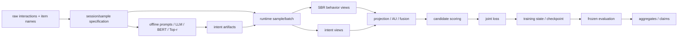

# Multi-view Intent Learning and Alignment with Large Language Models for Session-based Recommendation：Source-Blind 论文学习与代码审计准备指南

> 论文正式简称为 **LLM4SBR**。项目名和用户请求中的“LLM4RS”在本指南中按论文正式简称理解。

## 使用边界

### 当前模式与材料权限

- 当前模式：**A - Source-Blind Pre-Audit Learning**。
- 本轮论文证据源只有 `2402.13840v2.pdf`（25 页，SHA-256：`61a0f905eb487105453ed713b105f9fc2bb67fab3da5af5c721d51a0a3c9de1d`）。没有单独提供 appendix、supplement 或勘误文件。
- 新协议文件 SHA-256：`63cd6bb7c67ce4189e235d86016b9cf45d82475ceb28c80d47787ff2ddc9555d`。
- 研究代码审计技能的通用四级框架、质量门和 artifact contract 仅用于组织“怎样衔接后续训练”，不属于论文证据。
- 本轮未搜索、读取、引用或推断作者源码、第三方实现、训练候选、答案映射、Git 历史、`DO_NOT_OPEN_UNTIL_FINISHED/` 或 hidden probes；即使工作区中存在这些材料，也保持 source quarantine。
- 本指南不创建源码、配置、测试、训练产物或候选判断。文中的模块名、接口和伪代码只是从论文抽象出的审计模型，不是作者文件结构。

### 证据标签

- `[P] Paper`：论文明确写出的正文、公式、算法、图、表或脚注。
- `[I] Inference`：从一个或多个 `[P]` 推导出的必要或合理解释；必须说明依赖。
- `[A] Assumption`：论文没有唯一规定的可替换分支。本模式不冻结“作者一定采用”的唯一答案。
- 本模式没有运行实现或实验，因此**没有本地 `[E] Experiment` 证据**；论文表格中的数字仍标为 `[P]`。

### Source-blind 正确性声明

这是仅依据论文公开材料建立的独立审计基准。后续代码只有违反 `[P]` 或由 `[P]` 必然推出的 `[I]` 时，才可能形成强制性 finding；代码与某个 `[A]` 分支不同，本身不构成错误。本指南不预判任何候选。

## 60 秒全景

**任务。** 输入匿名用户当前会话的有序点击前缀 \(s=[i_1,\ldots,i_L]\)，预测下一次点击 \(y=i_{L+1}\) `[P, §3]`。

**核心思想。** LLM4SBR 把系统拆成两个阶段 `[P, Fig.1]`：

1. **Intent Inference**：把物品序列写成长/短期两个 prompt，LLM 生成意图文本；BERT 编码回答和物品名；Top-\(r\) 语义检索把自由文本定位回真实物品语义空间。
2. **Representation Enhancement**：可替换的 SBR backbone 从 ID 交互得到局部/全局行为表示；文本意图被投影、分视角对齐和均匀化，并以门控方式增强会话表示，最后对物品候选打分。

```text
有序点击 + 物品名称
  ├─ long prompt  → LLM → BERT → Top-r localization → long intent
  ├─ short prompt → LLM → BERT → Top-r localization → short intent
  └─ item IDs → SBR backbone → local behavior + global behavior
       same-view alignment/uniformity + cross-modal gates
       → fused session representation → item scores → probabilities/ranking
```

阅读顺序：Unit 1 建立论文地图；工程化前置章建立“若要审计完整程序，应有哪些层和交接”；Unit 2 固定数据身份与泄漏边界；Unit 3 固定意图本地化数学契约；Unit 4 固定对齐、融合和预测语义；Unit 5 固定损失、训练、评估与 claim 范围；最后汇总为 `PRE_AUDIT_BASELINE`，再说明 Level 1-4 需要新增哪些证据。

## Unit 1：下一物品推荐、双视角意图与论文完整数学地图

### 1. 在整套系统中的位置

本 Unit 的上游是论文任务和原始会话概念，下游是工程系统图以及 Unit 2-5 的审计 contract。它只回答“论文声称系统做什么、为什么这样做”，不决定 padding、BERT pooling、缓存格式、loss API 或作者类名。

### 2. 要解决的问题

传统 SBR 依赖短而稀疏的匿名 ID 序列。相似语义的物品可能拥有完全无关的 ID，单靠交互难以识别潜在兴趣 `[P, §1]`。直接把 LLM 当推荐器又面临三个论文所述问题：会话匿名且短、微调成本高、生成可能越出候选或幻觉 `[P, §1]`。论文因此用离线 LLM 负责语义推断，用小型 SBR 负责协同建模，再对两种表示做分视角对齐与融合。

必须区分：

- “ID 稀疏造成语义不足”是研究动机，不是对所有 backbone 的定理。
- “LLM 能推断意图”在论文案例与下游指标中得到支持，但没有直接的意图真值数据验证 `[I, 依赖 Fig.8/Table 3]`。
- “轻量”主要指第二阶段不参与 LLM 训练/推理；离线生成本身仍有成本 `[P, §5.5]`。
- “plug-and-play”是模块化主张；Table 3 中仍有少数 backbone/metric 下降 `[P]`。

### 3. 通俗机制与关键术语

- **Session-based recommendation (SBR)**：只看当前匿名会话，预测下一个物品。
- **Local/short-term representation**：最近点击附近的偏好。论文以 SR-GNN 最后点击物品的表示作为 local `[P, §4.2.1]`。
- **Global/long-term representation**：聚合整段会话得到的总体偏好。论文原型使用软注意力 `[P]`。
- **Intent localization**：不是要求 LLM 必须输出合法 ID，而是把回答嵌入后，在真实物品名称库里找最相似的 \(r\) 个锚点。
- **Alignment**：同一会话、同一视角的文本与行为向量彼此靠近。
- **Uniformity**：让不同样本的表示不要全部坍缩到同一点。
- **Logit/score/probability**：logit 是 softmax 前分数；概率沿候选物品轴归一；排序由分数或概率产生。

### 4. 论文规格与贡献地图

| 贡献 | 解决的缺口 | 依赖 | 论文证据与限制 |
|---|---|---|---|
| 长/短期多视角 prompt | 宽泛 prompt 缺少方向性 | 有序点击、名称和 ID | `[P, Fig.2-3, §4.1.1]`；“可扩展到更多视角”是主张，未系统验证 |
| Intent localization | 回答可能模糊或目录外 | BERT 物品库、余弦 Top-r | `[P, Eq.(2)-(5), Fig.4]`；BERT pooling 等未写 |
| 可替换 SBR backbone | 保留 ID 协同建模能力 | backbone 能给 local/global | `[P, Eq.(6), §4.3]`；当前论文没有重述各 backbone 全部内部公式 |
| 分视角 alignment/uniformity | 文本与行为空间不统一 | short↔local，long↔global | `[P, Eq.(7)-(9)]`；Eq.(9) 的 pair/reduction 不完整 |
| 门控融合与预测 | 把语义信息注入最终会话表示 | 投影维度与候选表示 | `[P, Eq.(10)-(13)]`；是否直接拼入文本存在图/公式解释边界 |
| 两数据集、六 backbone、消融与资源实验 | 检查效果、组件、r 和成本 | 特定数据与协议 | `[P, §5]`；没有多 seed/显著性/完整预算披露 |

### 5. 数学与 tensor 总 contract

定义：batch 大小 \(B\)，padding 后序列长度 \(L\)，物品数 \(N\)，文本维 \(d_t\)，SBR 隐维 \(d\)，语义近邻数 \(r\)。

| 公式 | 目的 | 单样本 → batch shape | 轴与操作 | 输出/梯度审计重点 |
|---|---|---|---|---|
| (1) | 两视角 LLM 推断 | string → B strings | 生成，不是 tensor | 文本回答；解码规则未知 A4 |
| (2)-(3) | 编码回答与物品名 | `[d_t]`, `[N,d_t]` → `[B,d_t]`, `[N,d_t]` | token pooling 轴未知 A5 | 阶段 2 是否冻结由两阶段叙述推导 I1 |
| (4)-(5) | Top-r 本地化 | scores `[N]` → `[B,N]`; gather `[B,r,d_t]` | cosine 沿 \(d_t\)，top-r 沿 \(N\)，sum 沿 \(r\) | intent `[B,d_t]`; 权重归一化/负值未知 A6 |
| (6) | 行为编码 | IDs `[L]` → two `[d]`; batch `[B,L]` → two `[B,d]` | backbone 特定；顺序与 mask 关键 | local/global；backbone 细节 A8 |
| (7)-(9) | 投影、对齐、均匀 | `[B,d_t]→[B,d]`; paired `[B,d]` | feature 距离沿 d，样本聚合/配对未知 A12 | scalar aux losses；梯度到投影/backbone I6 |
| (10)-(12) | 门控融合 | four `[B,d]` → two gates → `[B,d]` | elementwise sigmoid；Q 内积沿 d；concat 沿 feature | session `[B,d]`; gate 范围与文本使用点 A9/A10 |
| (13) | 候选打分 | `[B,d]@[d,N]→[B,N]` | softmax 沿 N | probability `[B,N]`; candidate/tying A11 |
| (14)-(15) | 联合目标 | target `[B]` 或 one-hot `[B,N]` | 文字 CE 与公式 BCE 冲突 A13 | scalar total；\(\tau\) 只乘辅助和 `[P]` |

关键符号：

| 符号 | 论文语义 | 审计时应追踪的工程对象 |
|---|---|---|
| \(s_t,I_t\) | 有序会话/交互物品 | 原始实体 ID、prefix identity、`item_ids[B,L]`、mask |
| \(y,\hat y\) | 下一物品真值/预测 | target 的 item-ID 空间与 class-column 空间 |
| \(E_{item}\) | 物品名文本表示 | catalog 行顺序、encoder revision、pooling、缓存 lineage |
| \(h^{st}_{infer},h^{lt}_{infer}\) | 本地化后的两视角意图 | `[B,d_t]`；投影后 `[B,d]` |
| \(H^l,H^g\) | local/global 行为表示 | `[B,d]`；short/local 与 long/global 对应 |
| \(T,Q_1,Q_2,W\) | 投影、门控和融合参数 | shape、共享关系、bias、梯度是否存在 |
| \(V\) | 候选物品表示 | `[N,d]`；与输入 embedding 是否共享未知 |

### 6. 完整 worked example：贯穿全文的非对称会话

设物品目录为：1“红茶”、2“咖啡豆”、3“茶壶”、4“跑鞋”、5“绿茶”。会话记录为 `[1,2,1,3,5]`，训练样本前缀 `[1,2,1,3]`，target 为 5。重复物品 1、末项 3、target 5 故意不同，可暴露去重、顺序、最后有效位置和标签偏移错误。

长期 prompt 可能得到“绿茶”，短期 prompt 可能得到“茶具”；这只是 `[A4]` 的教学回答，不是对真实 LLM 输出的 `[P]`。本地化把两个回答锚定到目录内物品；backbone 从 ID 前缀得到 local/global；short 语义对应 local，long 语义对应 global；融合后对 5 个候选打分，target 必须落到“物品 5 对应的那一列”。后续 Unit 给出完整数值。

### 7. 工程映射（解释性，不是作者结构）

```text
RawSession → Session/Sample Contract → Prompt/Intent Artifact
           → Runtime Batch → Behavior Views + Intent Views
           → Alignment/Fusion → Candidate Scores
           → Loss State / Evaluation Records → Claims
```

审计接口应优先使用带语义字段的对象，例如 `sample_id`, `parent_session_id`, `local`, `global`, `short_intent`, `long_intent`, `logits`。这些名字是 `[I]` 的审计抽象，不代表作者 API。关键不是类名，而是每个对象的身份、shape、候选列和梯度路径可追溯。

### 8. 假设与备选解释

- `[A1-A3]` 数据版本、切分、ID/PAD/mask 均未完整规定。
- `[A4-A7]` LLM 解码、prompt 精确串、BERT pooling、Top-r 权重、缓存失败策略未完整规定。
- `[A8-A11]` backbone 内部、投影共享、gate 标量范围、候选 embedding tying/bias 未完整规定。
- `[A12-A16]` uniformity、推荐 loss、checkpoint、候选/metric、比较预算与统计规则未完整规定。

模式 A 不在此选择唯一分支；worked example 使用的临时数值只用于证明 contract 是否自洽。

### 9. 注意事项与易错点

| 错误 | 为什么诱人 | 后果 | 最小检测 |
|---|---|---|---|
| 把 \(I_t\) 当数学集合并去重 | Eq.(6) 使用集合符号 | 重复与顺序丢失，local/global 变化 | 比较 `[1,2,1,3]` 与 `[1,1,2,3]` |
| 把文本直接拼入最终向量当成论文唯一实现 | Fig.1 视觉箭头较抽象 | 可能违背 Eq.(12) 的行为门控解释 | 逐项追 Eq.(10)-(12)，标出每个 concat 输入 |
| 混淆 logits 与 probabilities | Eq.(13) 同时描述 score 和 softmax | 双 softmax或错误 loss | 断言 logits 可负且行和不必为 1 |
| short/long 对应接反 | 两者 shape 完全相同 | 语义错误但可训练 | 非对称视角 fixture，逐支路置换 |
| 把论文表格记成当地实验 | 数字具体且看似“结果” | 混淆证据来源 | 所有论文结果仅标 `[P]` |
| 用 `[A]` 判候选错误 | 个人偏好像“标准做法” | 破坏 source-blind 审计 | finding 必须回链 `[P]` 或必要 `[I]` |

### 10. 本 Unit 的产出

产出是论文问题定义、贡献依赖、全公式 shape 主干、同一非对称 fixture、初始 claim 边界和未知项索引。它为 Level 1 提供公式位置和强制/非强制边界，但没有给出候选结论。

## 工程化大框架（组件实现前置章）

> 本章是从论文推导的审计系统模型 `[I]`，用于以后追踪数据和状态；不是作者源码目录。

### 1. 论文特定的七层分层

| 层 | 审计职责 | 不负责 | 证据来源 |
|---|---|---|---|
| 入口与配置 | 固定数据、模型、seed、r、tau、backbone 和运行角色 | 不偷偷补论文默认值 | `[I]`；论文超参 `[P, §5.1.3]` |
| 离线预处理与静态产物 | 会话化、物品表、prompt、LLM/BERT、Top-r intent artifact | 不在训练 batch 中随机重做语义 | `[P, Fig.1, §5.5]` + I1 |
| 运行时数据管线 | 以样本身份联结 prefix、target 和两视角 intent | 不定义模型数学 | `[I]`，为保证两阶段对象可对齐 |
| 模型与表示 | backbone、T、Q、W、candidate head | 不决定 split/metric | `[P, Eq.(6)-(13)]` |
| 目标函数 | recommendation、alignment、uniformity 和 tau | 不决定 checkpoint | `[P, Eq.(8)-(9),(14)-(15)]` |
| 训练编排与持久化 | optimizer/scheduler、validation、checkpoint、RNG | 不读取 protected test 选模型 | 论文部分 `[P]`，大量未知 A14 |
| 评估与报告 | 候选排序、P/MRR/NDCG、聚合、表格与 claim | 不回流 test 信息做适配 | `[P, §5]` + 审计隔离 `[I]` |

### 2. 模块职责与依赖方向



依赖方向的强制语义 `[I]`：sample identity 必须同时约束行为和 intent；evaluation 读取已选 checkpoint，不能反向决定训练选择；报告必须从完整 evaluation 记录派生。具体 import、文件和缓存格式均属 `[A]`。

### 3. 端到端训练调用链

1. 解析实验配置，记录论文已给和未给的字段。
2. 初始化环境/RNG；论文没有 seed `[A14]`。
3. 载入 split、ID map、静态 intent artifact，并核对它们属于同一数据版本 `[I]`。
4. 按 sample identity 组装 prefix、target、short/long intent；padding/collate 规则未知 `[A3]`。
5. backbone 输出 local/global；T 投影 intent；AU 计算辅助目标；Q/W 融合并产生 logits `[P]`。
6. 总损失按 Eq.(15) 组合；推荐 loss 的确切解释保留 A13 两分支。
7. `zero_grad → forward → loss → backward → optimizer step` 是框架级审计状态机 `[I]`；论文只明确 Adam/LR/L2/schedule，不给所有细节。
8. validation/model selection/checkpoint 的存在方式未披露 `[A14]`；后续代码阶段必须追踪 role，不得假定。
9. 训练记录需保留每 epoch 状态，才能在 Level 2 验证 resume、scheduler 和 protected evaluation 顺序。

训练专属对象：梯度、optimizer/scheduler、AU pair 或采样、参数更新、checkpoint 变更。Stage 1 的 LLM/BERT 是否完全预先冻结由两阶段和 §5.5 推导为 I1，仍需后续证据核对。

### 4. 独立推理与评估调用链

固定配置和 checkpoint → 载入确定性样本/intent → backbone 与 fusion/head forward → 构造候选/过滤 → 排序 → 每样本 rank 记录 → 按 K=5/10/20 聚合 P、MRR、NDCG → 形成表格和 claim。

推理/评估不需要 backward、optimizer、scheduler 或参数更新；通常也不需要 AU loss。单样本输出是候选排序，数据集指标是独立实体上的聚合。候选过滤、tie、分母和 checkpoint role 均不得从最终均值反推。

### 5. 论文概念到审计模块总映射

| 论文概念 | 位置 | 审计模块 | 输入 → 输出 | 深入 Unit |
|---|---|---|---|---|
| next-item task | §3 | sample/target specification | session prefix → next item | 2 |
| prompt design | Fig.2-3 | prompt artifact | ordered names/IDs/view → text | 2/3 |
| LLM/BERT | Eq.(1)-(3) | offline semantic artifact | prompt → answer → vector | 3 |
| localization | Eq.(4)-(5) | semantic retrieval contract | query/catalog → Top-r intent | 3 |
| SBR views | Eq.(6) | backbone adapter contract | IDs/mask → local/global | 4 |
| projection/AU | Eq.(7)-(9) | cross-modal contract | intent/behavior → aligned vectors/loss | 4/5 |
| gates/fusion | Eq.(10)-(12) | fusion contract | four views → session vector | 4 |
| scoring | Eq.(13) | candidate-space contract | session × items → logits/probs | 4 |
| joint loss | Eq.(14)-(15) | objective contract | output/target/aux → scalar | 5 |
| tables/figures | §5 | evidence/claim contract | run population → aggregates → claims | 5 |

解释性“审计表面树”如下；它描述以后需要核对的责任，不创建文件，也不代表作者目录：

```text
audit-surface/                     # conceptual only
├── paper-spec                     # claims, formulas, contradictions
├── data-contract                  # parent/sample IDs, split, ID spaces
├── stage1-artifacts               # prompts, answers, embeddings, Top-r lineage
├── runtime-batches                # joint behavior/intent/target identity
├── model-intermediates            # local/global/z/gates/session/logits
├── training-state                 # losses, optimizer, scheduler, checkpoints
├── evaluation-records             # candidates, per-example ranks, misses
└── scientific-evidence            # planned/observed/aggregate/claims
```

### 6. 跨层 tensor 与接口交接

| 提供方 → 消费方 | 对象语义 | shape/dtype/device | ID/mask/阶段 | 标签 |
|---|---|---|---|---|
| sample spec → runtime | prefix/target/identity | variable ints; target scalar | raw/internal/class 映射未知 A3 | `[P]+[A]` |
| offline stage → runtime | short/long intent | each `[d_t]`, float | 应与同一 prefix identity 对齐 I2 | `[P]+[I]` |
| runtime → backbone | IDs/mask/length | `[B,L]` long; mask bool convention未知 | train/eval 同语义 | `[I]+[A3]` |
| backbone → AU/fusion | local/global | each `[B,d]`, float | short↔local, long↔global | `[P]` |
| T → AU/fusion | projected intents | each `[B,d]` | 是否共享 T/bias A9 | `[P]+[A]` |
| fusion → head | session | `[B,d]` | train/eval 参数相同 | `[P]` |
| head → loss/metric | logits/probability | `[B,N]` | candidate 列与 target 对齐 A11/A15 | `[P]+[A]` |
| evaluation → report | per-sample ranks | one row/entity | misses 必须计入分母 I7 | `[I]` |

### 7. 全系统状态与生命周期

| 状态 | 何时产生 | 梯度/device | 是否应可追溯 | 未知 |
|---|---|---|---|---|
| 数据版本/split/ID map | 预处理 | no-grad/CPU | 是 | A1-A3 |
| prompts/LLM answers/item text embeddings | Stage 1 | 论文称预训练/推断 | 是 | A4-A7 |
| localized intents | Stage 1 | Stage 2 中应视作输入 I1 | 是 | cache 粒度 A7 |
| backbone/T/Q/W/item parameters | Stage 2 init | grad/device | checkpoint | A8-A11 |
| batch tensors/intermediates | 每 step | inputs no-grad; params receive grad | 通常只日志摘要 | mask/reduction |
| optimizer/scheduler/RNG | 训练 | mixed | resume 时必须一致 I8 | A14 |
| checkpoint/model-selection evidence | epoch/validation | no-grad artifact | 是 | A14 |
| per-sample eval/aggregate/claim | 评估/报告 | CPU/no-grad | 是 | A15-A16 |

### 8. 依赖驱动的后续审计顺序与最小纵向切片

模式 A 不实现代码，但先规定以后应按：论文规格 → 非对称 fixture → 数据身份 → localization → behavior adapter → AU/fusion/head → loss/metric → training state → evaluation lineage → claim。最小纵向切片只需两个样本、五个物品、手写 intent 和确定性 behavior views，能够暴露 ID 偏移、视角接反、轴错误、双 softmax 和 metric 分母问题。

这个顺序不是训练 Gate，也不是作者开发顺序；它是 `[I]` 的审计证据顺序。任何长训练结果都不能替代前面的局部数学证据。

### 9. 框架级未知项与变更点

- A1-A3 改变样本人口、身份和候选列，影响所有下游 artifact。
- A4-A7 改变语义输入和缓存 lineage，但理论上不应改变 Stage 2 的字段语义。
- A8 改 backbone 时 local/global 内部来源改变，adapter contract 应保持。
- A9-A13 改变参数、梯度和目标函数，是 Level 1 高风险点。
- A14-A15 改变 checkpoint、候选与 metric，是 Level 2 高风险点。
- A16 改变比较公平性、实验单位和 claim，是 Level 3 高风险点。
- Level 4 的批准、预算、停止和 protected-evidence 规则不在论文中，必须另外冻结，不能列为“作者未写所以随意”。

## Unit 2：Beauty / ML-1M 会话身份、切分与数据审计契约

### 1. 在整套系统中的位置

本 Unit 放大前置章中的“预处理、静态产物、运行时数据”。上游是 ratings/interactions 和物品文本；下游是 Unit 3 的 prompt/intent 与 Unit 4 的 behavior batch。它输出的不是某个作者 `Dataset` 类，而是可强制审计的实体身份、样本边界、target 语义和泄漏规则。

### 2. 要解决的问题

如果不知道“先按谁切分、再怎样展开 prefix”，同一原始用户/会话的近重复样本可能跨 train/test。若 behavior 样本与 intent artifact 只按行号联结，shuffle 后可能错配。若 item ID、PAD 和 target class 没有明确空间，所有 logits 列都可能整体偏移而 shape 仍正确。数据 contract 因此先于模型代码。

### 3. 通俗机制：从历史到监督样本

给定原会话 `[1,2,1,3,5]`，下一物品监督样本可写成 `prefix=[1,2,1,3], target=5`。Beauty 论文明确使用 sequence segmentation augmentation，把长度 n 的会话展开为 n-1 个 prefix/next-item 样本 `[P, §5.1.1]`。ML-1M 明确以相邻交互 10 分钟作为会话切点 `[P]`；论文 §5.4 说 ML-1M 不使用该 sequence segmentation augmentation，但没有完整说明一个会话最终产生几个训练实例 `[A2]`。

关键独立实体可能是 user、raw session 或已展开 prefix。科学切分应先明确哪个实体独立，再展开；否则多个 prefix 不是独立观察。论文没有披露 split 算法和 validation `[A2]`。

### 4. 论文数据规格

| 项目 | Beauty | ML-1M | 论文事实与缺口 |
|---|---|---|---|
| 来源 | Amazon Beauty ratings/evaluations | MovieLens-1M | `[P, §5.1.1]` 给下载脚注；快照日期、许可条款未写 A1 |
| 会话 | 单用户全部评分序列作为 session | 同用户序列按 10 分钟间隔切 session | `[P]`；timestamp tie、排序规则 A2 |
| 过滤 | 删除长度 1 session；删除全 sessions 出现少于 5 次 item | 同左 | `[P]`；先后、是否迭代、切分前后 A1 |
| 扩展 | 明确 prefix expansion | 论文称不使用该 augmentation | `[P]`；ML-1M target 生成 A2 |
| Train/Test | 158,139 / 18,000 | 47,808 / 5,313 | `[P, Table 2]`；没有 validation |
| Clicks | 198,502 | 987,610 | `[P, Table 2]`；统计是在 raw/session/sample 哪层需核对 A1 |
| Items | 12,101 | 3,416 | `[P, Table 2]` |
| Avg.len | 8.66 | 17.59 | `[P, Table 2]`；平均对象未进一步定义 A1 |

数据统计是以后核对预处理 lineage 的锚点，不是“只要最终数字相同就证明切分正确”。不同错误流程可能碰巧产生相同总数。

### 5. 数学与 tensor contract

模式 A 规定语义字段，不冻结存储格式：

| 字段 | 语义 | 单样本/batch shape | 强制/未知边界 |
|---|---|---|---|
| `raw_entity_id` | 切分前独立实体（user/session） | scalar/string | 实体选择 A2；必须能追到所有 prefix I3 |
| `sample_id` | 一个 prefix-target 的稳定身份 | scalar/string | 必须同时联结 behavior 与两个 intent I2 |
| `item_ids` | 保序、保重复的 prefix | `[L_b]` → `[B,L]` long | PAD/内部映射 A3 |
| `length` | padding 前有效长度 | scalar → `[B]` long | 应等于有效 mask 数 I4 |
| `valid_mask` | 有效位置 | `[L_b]` → `[B,L]` bool | True/False 约定 A3 |
| `target_item` | 下一真实物品 | scalar | 不得出现在 prompt 的未来位置 `[P]+I5` |
| `target_class` | logits 列索引 | scalar → `[B]` long | 与 item ID 偏移关系 A3 |
| `short/long_intent_ref` | 同一 sample 的静态语义 artifact | each key/vector | 粒度、失败和 hash A7 |

不可妥协的 `[I]`：同一 tensor row 的 prefix、target、short intent、long intent 必须具有共同 sample identity；联合 permutation 必须一起发生；任何 split 隔离应在 prefix expansion 之前以声明的原始独立实体检查。

### 6. 完整 worked example：身份、padding 与 target

教学上临时采用 `[A3-demo]`：PAD=0，真实物品 internal ID 为 1..N，target class 为 `item_id-1`，右 padding，`True=valid`。这不是作者事实，也不能据此判错。

样本 A：parent=`s0`，prefix `[1,2,1,3]`，target item 5/class 4。样本 B：parent=`s1`，prefix `[2,4]`，target item 1/class 0。batch 为：

```text
ids      [[1,2,1,3],
          [2,4,0,0]]       shape [2,4], int64
mask     [[T,T,T,T],
          [T,T,F,F]]       shape [2,4], bool
lengths  [4,2]
targets  [4,0]             class-column space
```

最后有效物品索引为 `length-1`，得到 `[3,4]`。直接取最后一列得到 `[3,0]`，第二行读取 PAD，shape 却完全合法。若交换 batch 行，IDs、mask、target 和两个 intent ref 必须联合交换；只交换 IDs 是 Level 2 的身份破坏。

prefix expansion 的泄漏例：若 `s0=[1,2,1,3,5]` 先展开出四个高度相关 prefix，再随机切分，这些 prefix 可能跨 train/test。先按 parent `s0` 切分再展开可避免这种父实体交叉；论文是否如此操作未知 A2。

### 7. 工程映射与解释性伪代码

```text
raw events
  → stable ordering
  → sessionization
  → filtering
  → split by declared independent entity
  → optional prefix expansion within split
  → item-ID mapping / sample identity
  → join intent artifacts by sample_id
  → joint collate
```

审计时应从最终 batch 反向追到 raw entity，而不是只看某个 `__getitem__` 返回 shape。解释性接口可以写成：

```python
build_sessions(events) -> sessions
split_entities(sessions) -> split_manifest
expand_samples(split_manifest) -> samples
join_intents(samples, intent_manifest) -> joined_samples
collate(joined_samples) -> batch
```

这些函数名是 `[I]` 的责任分解；作者可以完全不同地组织文件，只要行为满足论文强制 contract。

### 8. 假设与备选方案

- `[A1]` 数据快照、过滤顺序、固定点迭代、统计口径、许可记录：全量过滤与 train-only 过滤都会改变 population；模式 A 不选。
- `[A2]` stable sort、10 分钟边界的 `>`/`>=`、split 单位和比例、ML-1M 样本化、validation：所有合理分支并列保留。
- `[A3]` raw/internal/class/PAD 空间、padding 方向、mask 布尔语义、UNK：示例只使用一个教学分支。
- `[A7]` intent 是 per-session 还是 per-prefix、失败如何保留、manifest 如何校验：会影响身份完整性。

进入代码阶段应寻找：原始实体 ID 是否保留；split 在 expansion 前还是后；item map 的 fit scope；filter 执行日志；每个 sample 的 intent key；miss/失败是否从分母中消失。

### 9. 注意事项与易错点

| 错误 | 为什么诱人 | 后果 | 最小检测 |
|---|---|---|---|
| expansion 后随机 split | 样本数多、代码简单 | 同 parent 泄漏 | 比较 train/test parent ID 集合 |
| test 参与词表/图/流行度 | “所有 item 都已知” | protected 信息进入训练 | 追踪每个静态统计的 fit split |
| behavior 与 intent 按行号 join | 两文件行数相同 | shuffle/过滤后错配 | 打乱一边，sample_id join 应保持语义 |
| 原始 ID 直接作 embedding index | 有些数据恰好近似连续 | 空洞/越界/列错位 | raw↔internal 往返和连续性 |
| PAD 与合法 item/class 冲突 | 0 常被同时复用 | PAD 进入候选或 target | 断言特殊 ID 无候选列 |
| 取 padded 最后一列 | 定长 batch 写法方便 | local 读取 PAD | 双长度非对称 fixture |
| prompt 包含 target 名称 | 构造 prompt 时使用完整 session | 标签泄漏 | prompt source position 必须早于 target |
| 丢弃失败样本但不改分母/manifest | 避免异常 | population 与指标偏移 | planned、observed、included ID 对账 |

### 10. 本 Unit 的产出

产出是数据来源/统计锚点、原始独立实体与 sample identity contract、split-before-expansion 审计规则、ID/PAD/target 未知分支、非对称 batch fixture 和 Level 2 lineage 检查点；没有生成任何数据处理代码。

## Unit 3：双视角 Prompt、BERT 表示与 Top-r Intent Localization 数学契约

### 1. 在整套系统中的位置

本 Unit 对应 Stage 1。它消费 Unit 2 的有序 prefix、物品名称/ID 和 sample identity，输出同一 sample 的 long/short intent 表示，供 Unit 4 投影与融合。它解决“LLM 自由文本不一定是候选目录内精确物品”的问题。

### 2. 要解决的问题

LLM 可能返回精确物品名、模糊类别、关键词或目录外物品 `[P, §4.1.3, Fig.4]`。若直接把回答当 candidate ID，无法稳定对齐物品全集；若只保留回答 embedding，则仍可能远离真实目录语义。论文用真实物品名称 embedding 作为锚点，把回答表示成最相似 \(r\) 个物品向量的加权和。

### 3. 通俗机制与最低前置知识

**BERT sentence vector。** BERT 原生给 token hidden states；要得到一句话的 \([d_t]\) 表示必须选择 CLS、mean pooling 或其他聚合。论文只指定 `bert-base-uncased`，没有给 pooling `[A5]`。

**Cosine similarity。** \(\cos(q,e)=q^Te/(\|q\|\|e\|)\)，比较方向而非长度。batch 中 query `[B,d_t]` 与 catalog `[N,d_t]` 可形成 `[B,N]` score matrix。

**Top-r 与 gather。** 每个 query 沿 N 个物品选最高 r 个索引，再从 catalog gather `[B,r,d_t]`，按 score 加权后沿 r 求和。Top-r 轴不是 feature 轴。

### 4. 论文规格

- prompt 包含背景描述和任务定义；每个点击物品由“序号 + 名称 + ID”组成，并加入 long-term 或 short-term 限定 `[P, Fig.2]`。
- LLM 以问答形式分别返回两个视角的结果 `[P, Eq.(1), Fig.3]`。
- 回答和所有物品名都经 `bert-base-uncased` 编码 `[P, Eq.(2)-(3), footnote]`。
- 对每个回答与所有物品计算 cosine，取 Top-r，按相似度乘物品 embedding 后求和 `[P, Eq.(4)-(5)]`。
- 初始实验设置 r=5；图 7 比较 r=0/1/3/5 `[P, §5.1.3/5.4]`。

Eq.(4) 的 \(i,j\) 索引写法不够一致。为审计 tensor 语义，可重写为 `[I9, 依赖 Eq.(4)-(5)]`：

\[
s_{b,j}=\frac{q_b^Te_j}{\|q_b\|_2\|e_j\|_2},\quad
J_b=\operatorname{TopR}_j(s_{b,j}),\quad
h_b=\sum_{j\in J_b}s_{b,j}e_j.
\]

### 5. 数学与 tensor contract

| 字段 | Contract |
|---|---|
| 论文位置 | Fig.2-4；Eq.(1)-(5)；Algorithm 1 lines 1-7 |
| 输入 | B 个同视角回答，N 个物品名称 |
| shape | query `[B,d_t]`; catalog `[N,d_t]`; scores `[B,N]`; indices/weights `[B,r]` |
| dtype/device | token IDs 通常 integer、mask bool/int、embedding float；具体 device `[A5]` |
| 归一化轴 | cosine norm 沿 d_t；Top-r 沿 N；weighted sum 沿 r |
| 参数 | BERT 参数是否冻结、revision、pooling 未明 A5 |
| 输出 | per-sample/per-view intent `[B,d_t]`; sample identity 必须保留 I2 |
| 梯度 | 两阶段与 §5.5 支持 Stage 2 不反传到 LLM/BERT 的推导 I1；作者具体缓存/训练图仍待核对 A7 |
| 边界 | r=0、r>N、tie、zero vector、negative cosine 未定义 A6 |

解释性伪代码：

```python
scores = cosine_matrix(query, catalog)       # [B,N], normalize feature axis
top_scores, top_ids = top_r(scores, axis="items")
picked = gather_catalog(catalog, top_ids)    # [B,r,d_t]
intent = sum(top_scores[..., None] * picked, axis="neighbors")
```

这只是 Eq.(4)-(5) 的 tensor 展开，不声明作者使用某个框架 API。

### 6. 完整 worked example：非对称 Top-2

教学 fixture 临时令 5 个物品文本向量均为二维单位向量：

```text
e1 红茶=(1,0)       e2 咖啡豆=(0,1)
e3 茶壶=(0.8,0.6)   e4 跑鞋=(-1,0)
e5 绿茶=(0.6,0.8)
```

长期回答 query \(q_{lt}=(0.6,0.8)\)，scores 是 `[0.6,0.8,0.96,-0.6,1.0]`。教学中取 r=2，Top-2 为 item 5、3：

\[
h_{lt}=1.0(0.6,0.8)+0.96(0.8,0.6)=(1.368,1.376).
\]

短期回答 query \(q_{st}=(0.8,0.6)\)，scores 是 `[0.8,0.6,1.0,-0.8,0.96]`，Top-2 为 item 3、5：

\[
h_{st}=1.0(0.8,0.6)+0.96(0.6,0.8)=(1.376,1.368).
\]

输出范数大于 1，因为 Eq.(5) 印刷式没有除以权重和。实现若做 softmax 或加权平均，数值会不同；但论文是否省略了归一化仍属 A6，模式 A 不凭个人习惯定罪。这个近似镜像但不完全相同的 fixture 可检测 long/short 交换。

### 7. 工程映射

Stage 1 的解释性责任链：`prompt specification → generation artifact → text encoder artifact → catalog score matrix → Top-r indices/scores → localized intent + lineage manifest`。审计需要同时保留原回答、编码器标识、物品库版本、r、Top-r IDs 和最终向量，才能区分生成错误、编码漂移和定位错误。这是 `[I]` 的可审计性要求，不是论文声明的文件格式。

### 8. 假设与备选方案

- `[A4]` LLM 型号 revision、temperature/top-p、最大长度、停止符、失败重试、prompt 精确空白和语言。论文实验给 Qwen-7B-Chat，但没有完整 decoding。
- `[A5]` BERT revision、tokenization、CLS/mean pooling、特殊 token 是否进入 mean、截断、冻结、精度。
- `[A6]` 原 cosine/截负/softmax 权重；sum/weighted mean；r=0 语义；ties；r>N；negative similarity。
- `[A7]` per-session/per-prefix cache；answer 与 vector 是否都存；miss 是否保留；sample identity/hash；失败是否静默丢弃。

进入代码阶段仅当某行为直接违背 Eq.(4)-(5) 强制部分（例如沿 feature 取 Top-r）才是 Level 1 finding；不同 pooling 或 tie policy 应先归入未知分支。

### 9. 注意事项与易错点

| 错误 | 为什么 shape 可正常 | 后果 | 最小检测 |
|---|---|---|---|
| normalize 沿 batch 轴 | `[B,d_t]` shape 不变 | 同 query 随 batch 同伴变化 | 单独/混合 batch 结果一致性 |
| Top-r 沿 d_t | 若 d_t≥r 可运行 | 选 feature 而非 item | 手算 Top IDs 应为 `[5,3]` |
| gather query 而非 catalog | 广播/扩展可产生合法 shape | 输出不再锚定真实物品 | 改 catalog 行时输出应响应 |
| 先按 ID 排再 Top-r | 排名仍有 r 个 | 忽略语义分数 | 对照完整 `[B,N]` scores |
| 静默 softmax/renorm | 数值有限且看似合理 | 改变 Eq.(5) 尺度 | 检查手算 `(1.368,1.376)`，同时标 A6 边界 |
| BERT 处于随机 train 状态 | shape 不变 | 相同文本 embedding 漂移 | 相同输入重复 artifact hash |
| intent 与 sample 错联 | 每行仍是 `[d_t]` | 语义属于另一会话 | sample identity join 和联合 permutation |
| prompt 含 target | 结果异常“准确” | label leakage | prompt source index 审计 |

### 10. 本 Unit 的产出

产出是 Eq.(1)-(5) 的索引消歧、shape/axis contract、完整 Top-2 手算、Stage 1 lineage 需求、A4-A7 未知分支和 Level 1/2 的最小检测性质；没有调用 LLM、编码数据或生成缓存。

## Unit 4：SBR 行为视角、跨模态对齐、门控融合与候选预测契约

### 1. 在整套系统中的位置

本 Unit 对应 Stage 2 的表示与预测部分，消费 Unit 2 的 ID prefix/mask 和 Unit 3 的 long/short intent，输出 local/global behavior、投影后的 intents、门控、融合 session representation 以及候选 logits/probabilities。loss reduction 和科学评估留给 Unit 5。

### 2. 要解决的问题

文本 embedding 与 ID-based SBR 隐表示不在同一空间，不能直接比较。论文先用 T 映射文本，再把 long intent 对应 global、short intent 对应 local；alignment/uniformity 约束表示空间，两个 intent 又参与门控，形成最终会话表示 `[P, §4.2.2]`。如果视角、维度、concat 顺序或 candidate row 错位，模型仍可能运行但语义改变。

### 3. 通俗机制与最低前置知识

**SBR backbone contract。** 论文说 backbone 可替换，原型主要是 SR-GNN `[P]`。SR-GNN 把会话内唯一物品视为节点、相邻点击视为有向转移，用 GGNN 更新节点；最后点击节点作为 local，软注意力聚合为 global `[P, §4.2.1]`。当前论文未重述 GGNN 门方程、邻接归一化和 attention 公式，因此这些不是 LLM4SBR 论文可单独强制的细节 `[A8]`。

**线性投影。** \(T\in\mathbb R^{d\times d_t}\) 把文本向量变为 d 维，使它能与行为向量相加/比较 `[P, Eq.(7)]`。

**标量门控。** 先对行为与对应 intent 逐元素相加并 sigmoid，再与 \(Q\in\mathbb R^d\) 内积得到每样本一个 scalar。这个 scalar 广播乘整条 behavior vector。

### 4. 论文规格与关键歧义

行为视角：

\[
H_t^l,H_t^g=\operatorname{SBRModel}(I_t).\tag{6}
\]

投影和同视角 alignment：

\[
\tilde h_{infer}^{p}=Th_{infer}^{p},\qquad
L_a=\mathbb E_{(infer,t)\sim sess}\|\tilde h_{infer}^{p}-h_t^p\|_2^2.\tag{7-8}
\]

门控与融合：

\[
\alpha^{lt}=Q_1^T\sigma(H_t^g+H_{infer}^{lt}),\qquad
\alpha^{st}=Q_2^T\sigma(H_t^l+H_{infer}^{st}),\tag{10-11}
\]

\[
H_{sess}=W[H_t^l\alpha^{st};H_t^g\alpha^{lt}].\tag{12}
\]

候选预测：

\[
\hat y_i=\operatorname{softmax}(h_{sess}^Tv_i).\tag{13}
\]

审计歧义：

1. Eq.(10)-(11) 写 \(H_{infer}\) 而不是 Eq.(7) 的 \(\tilde h_{infer}\)。若 \(d_t\ne d\)，加法要求先投影，因此“使用投影后 intent”是 `[I10, 依赖 Eq.(7),(10)-(11) 的 shape]`，仍需代码证据核对 A9。
2. sigmoid 在 \(Q^T\) 之前，最终 alpha 不保证在 `[0,1]`；额外 scalar sigmoid/softmax 是 A10 分支，不是公式明示。
3. Eq.(12) 明示 concat 的是加权 local/global behavior；图 1 的箭头可能让读者以为文本向量直接拼入。以公式为强制数学基准时，文本主要通过 gate 和 auxiliary loss 影响结果 `[I11]`，但应记录图/公式解释差异。
4. Eq.(13) 没说 \(v_i\) 与输入 item embedding 是否共享、是否有 bias/normalize A11。

### 5. 数学与 tensor contract

| 公式组 | 输入/参数 | batch shape 与轴 | 输出 | 梯度路径 `[I6]` |
|---|---|---|---|---|
| Eq.(6) | IDs/mask；backbone params | `[B,L]→[B,d]×2` | local/global | recommendation + AU → backbone |
| Eq.(7) | intents `[B,d_t]`; T `[d,d_t]` | matmul feature axis | z_short/z_long `[B,d]` | AU + gate → T；原 intent artifact 无 Stage-2 grad I1 |
| Eq.(8) | paired z/h `[B,d]` | squared distance sum along d；sample reduction见 A12 | scalar per view/total | T + backbone |
| Eq.(10)-(11) | z/h `[B,d]`; Q `[d]` | add/sigmoid elementwise；dot along d | alpha `[B,1]` `[I]` | recommendation → Q/T/backbone |
| Eq.(12) | weighted local/global | scalar broadcast；concat last dim `[B,2d]`; W `[d,2d]` | session `[B,d]` | recommendation → W/all upstream |
| Eq.(13) | session `[B,d]`; items `[N,d]` | matmul gives `[B,N]`; softmax along N | probs `[B,N]` | recommendation → session/items |

顺序与 mask contract：最后点击必须是最后**有效**位置，不是 padded 最后一列；global 聚合必须屏蔽无效位置/节点；candidate special IDs 是否存在未知 A3/A15；target 列必须与 item row 同一映射。

### 6. 完整 worked trace：从四个视角到目标列

沿用 Unit 3 教学向量，临时令 T 为恒等映射：

```text
z_short=(1.376,1.368)   z_long=(1.368,1.376)
h_local=(0.2,0.8)       h_global=(0.9,0.1)
Q_long=(1,0)            Q_short=(0,1)
```

按 Eq.(10)-(11)：

\[
\alpha^{lt}=\sigma(0.9+1.368)\approx0.906,
\quad
\alpha^{st}=\sigma(0.8+1.368)\approx0.897.
\]

这里 Q 恰好选一个维度，所以 alpha 落在 0..1；一般 Q 内积不保证如此。

```text
weighted local  ≈ (0.179,0.718)
weighted global ≈ (0.815,0.091)
concat           = (0.179,0.718,0.815,0.091)
```

教学 W 令相同 feature 的 local/global 相加，得到 \(h_{sess}\approx(0.995,0.808)\)。令五个 candidate vectors 为：

```text
v1=(1,0), v2=(0,1), v3=(0.6,0.4), v4=(-1,0), v5=(0.8,0.9)
logits ≈ [0.995, 0.808, 0.920, -0.995, 1.523]
```

target item 5 必须对应最后一列并排名第 1。此 trace 可分别检测 short/long 交换、concat 顺序、W 方向、PAD candidate 和 item/class offset。所有数值都是教学 `[A]`，不是作者参数。

### 7. 工程映射与解释性 forward

```python
local, global_ = behavior_view_contract(ids, mask)
z_short, z_long = project(short_intent), project(long_intent)
alpha_short = reduce_Q(sigmoid(local + z_short))
alpha_long  = reduce_Q(sigmoid(global_ + z_long))
session = fuse(concat(local * alpha_short, global_ * alpha_long))
logits = score_against_catalog(session)
```

未来代码无论如何命名，都应能暴露或重建上述中间对象；只给最终 loss 很难判断哪条 contract 先被破坏。softmax 可用于输出概率，但若推荐 loss 接收 logits，就不能提前丢失 logits。

### 8. 假设与备选方案

- `[A8]` backbone 图构造、重复节点 alias、邻接方向/归一化、GGNN steps、attention、dropout、初始化；换 backbone 后 local/global 的确切定义。
- `[A9]` T 是否 short/long 共享、是否有 bias、gate 使用原 intent 还是 projected intent。
- `[A10]` Q 是 scalar gate 还是 vector gate；Q 后是否再激活；W bias、residual、LayerNorm、dropout、初始化。
- `[A11]` 输入/输出 item embedding 是否 tying；candidate bias/normalize；PAD 是否在 candidate matrix。
- `[A3/A15]` padding/mask、候选过滤、seen-item policy 和 target class mapping。

模式 A 不选择这些分支。只有与公式 shape/运算直接冲突的行为是强制 finding；“作者可能用了常见默认值”不是证据。

### 9. 注意事项与易错点

| 错误 | 为什么诱人 | 后果 | 最小检测 |
|---|---|---|---|
| padded `[:, -1]` 作为 local | 所有 batch 定长 | 短样本读取 PAD | Unit 2 双长度 fixture |
| long 对 local、short 对 global | 两个 tensor 同 shape | 视角语义反转 | 交换单支路并比较 worked trace |
| Q 写成 `[d,d]` vector gate | 广播自然 | 改变 Eq.(10)-(11) scalar contraction | alpha shape 应由公式推得 `[B,1]` |
| Q 后额外 sigmoid | “gate 应在0..1” | 改写公式 | 手算一般 Q，比较两种结果并标 A10 |
| concat global/local 顺序交换 | W 仍可训练 | 参数语义改变 | 固定 W fixture |
| 原始 d_t intent 直接与 d behavior 相加 | 当维度碰巧相同不报错 | 绕过 T、梯度不同 | 追 Eq.(7) 输出是否进入 gate |
| candidate 多 PAD 行 | logits 仅多一列 | target 全体偏移/PAD 被推荐 | N 与合法物品数一致性 |
| 手动 softmax 后又作为 logits | API 仍接受 float | 双 softmax | 保留负 logits 与手算概率 |
| `.detach()` 或 optimizer 漏 T/Q/W | forward 完全正常 | 某支路不学习 | recommendation/aux 分开做梯度 probe |

### 10. 本 Unit 的产出

产出是 Eq.(6)-(13) 的视角、shape、broadcast、concat、candidate 和梯度 contract；一个端到端数值 trace；A8-A11 的不可预判分支；以及可供 Level 1 使用的局部性质，但未创建 model 源码或判断任何候选。

## Unit 5：联合目标、训练状态、Top-K 评估与科学证据边界

### 1. 在整套系统中的位置

本 Unit 把 Unit 2-4 的对象连接成训练、checkpoint、evaluation 和 paper claim。上游是 logits、targets、两模态/两视角表示；输出是目标函数语义、状态机边界、per-example ranks、aggregates 与可允许的结论范围。它同时为 Level 1 的 loss 审计、Level 2 的生命周期审计和 Level 3 的科学审计提供基准。

### 2. 要解决的问题

模型能运行、loss 能下降并不证明公式正确；指标算术正确也不证明 split、候选、实验单位和比较公平。论文在 loss、uniformity、数据 split、候选协议、重复次数和统计不确定性上留有空白。模式 A 必须把“强制规格、矛盾、未知和 claim scope”分开，而不能选一个框架默认值冒充作者行为。

### 3. 通俗机制与训练状态机

三类目标：

- \(L_r\)：下一物品推荐目标。
- \(L_a\)：同一会话/视角的文本与行为向量靠近。
- \(L_u\)：不同样本的表示在各自空间分散。
- \(L=L_r+\tau(L_a+L_u)\)，论文 \(\tau=0.1\) `[P]`。

框架级状态机通常是 `zero_grad → forward → compute loss → backward → optimizer step` `[I]`。论文明确 Adam、lr=0.001、每 3 epochs 乘 0.1、L2=1e-5、batch=100、d=100、A100 `[P, §5.1.3]`，但没有 seed、epoch 上限、early stopping、model-selection metric、gradient clipping、AMP 和完整 checkpoint A14。

`train()`/`eval()` 控制 dropout/normalization 行为，`no_grad()` 控制 autograd；它们不是同一件事。具体代码需后续证据，本指南只冻结语义。

### 4. 论文规格、公式冲突与评估设置

Eq.(8) alignment 是同 view 的平方距离。Eq.(9) 的 uniformity 印刷式包含文本空间和行为空间的两个 `log exp(-2 distance^2)` 项与 prime 样本，但没有清楚给出 prime 如何采、期望/mean 在哪里、除 2 的作用范围 `[P, Eq.(9)]`。Algorithm 1 显示两视角分别累加后平均 `[P]`。所有高影响解释并列列入 A12。

Eq.(14) 的文字称 cross-entropy，且 Eq.(13) 已 softmax；但公式为：

\[
L_r=-\sum_{i=1}^N[y_i\log\hat y_i+(1-y_i)\log(1-\hat y_i)],\tag{14}
\]

这是 one-hot 上的逐项 binary cross-entropy 形式，不等于单标签多类 CE 的 \(-\log \hat y_{target}\)。这是明确的论文内部冲突，A13 不选唯一解释。

评估使用 P@K、MRR@K、NDCG@K，K=5/10/20 `[P, §5.1.2]`。页 13 脚注称 SBR 中 P/HR/Recall 计算公式相同 `[P]`，支持“单正例命中率式 P”的 `[I12]`；但 full-catalog vs sampled、seen filtering、ties、分母和 precise NDCG 仍未知 A15。

### 5. 数学与 tensor contract

| 对象 | 输入 shape | 强制 reduction/未知 | 梯度/状态 |
|---|---|---|---|
| recommendation | logits/probs `[B,N]`; target `[B]` or one-hot `[B,N]` | Eq.(14) sum N；batch reduction未写；CE文字冲突 A13 | 更新完整 Stage-2 prediction path |
| alignment per view | z/h `[B,d]` | squared L2 意味 feature sum；sample expectation写出 `[P]` | T + backbone |
| uniformity per view/modality | paired representations `[B,d]` | distance沿 d；pair、log/mean/2范围 A12 | T + backbone |
| view aggregation | short/long scalars | Algorithm 1 lines 10-16 支持累加后平均 `[P]` | 同上 |
| total | three scalars | `Lr + tau*(La+Lu)` `[P]` | tau 不应重复乘 |
| ranking | scores `[B,N]`, target column `[B]` | sort along N；tie/filter A15 | eval no-grad |
| metric aggregate | per-example rank/miss rows | population denominator必须包含所有合法 eval entities I7 | report state |

梯度路径 `[I6]`：推荐 loss 可到 candidate representation、W、Q、T、backbone；alignment/uniformity 可到 T 和 backbone；离线 intent artifact 不应因 Stage 2 backward 改变 I1。若作者设计不同，需要明确论文/代码证据。

### 6. 完整 worked example：CE/BCE 冲突与排名

Unit 4 logits 约为 `[0.995,0.808,0.920,-0.995,1.523]`，softmax 概率约为 `[0.218,0.181,0.202,0.030,0.369]`，target 是 item 5。

- 单标签 CE：\(-\log 0.369\approx0.996\)。
- 按 Eq.(14) 逐项 BCE：除 target 项外，还加 \(-\log(1-p_i)\)，总值约 \(1.70\)。

两者都 finite、都可能下降，却不是同一目标；后续不能仅凭训练曲线区分。

排名为 `[5,1,3,2,4]`，target rank=1。再设第二样本 target rank=3：

```text
K=2: hit/P=(1+0)/2=0.5; MRR=(1+0)/2=0.5; NDCG=(1+0)/2=0.5
K=3: hit/P=1.0; MRR=(1+1/3)/2=0.6667
     NDCG=(1 + 1/log2(4))/2=0.75
```

这是 `[A15-demo]` 的单正例、1-based、宏平均解释，用于检验实现；它不是论文未披露 metric 细节的作者答案。

### 7. 工程映射：状态、证据与 claim 层

```text
ModelOutput + target
  → loss components + gradient state
  → per-step/per-epoch train records
  → validation evidence → selected checkpoint
  → protected test per-example rows (including misses)
  → recomputed aggregates
  → structured claim with exact scope/evidence IDs
```

Level 2 应跨至少两个 artifact 验证 checkpoint role、resume/scheduler、eval population 和 denominator。Level 3 应把 planned runs、observed runs、aggregate 和 claim 四层分开；aggregate 即使算术正确，也可能因预算不公平、选择性排除或伪独立样本而科学无效。

### 8. 假设与备选方案

- `[A12]` uniformity：all pairs、随机无自配对、batch roll、memory bank；`log(mean(exp))`、`mean(log(exp))` 或印刷式逐 pair；是否 normalize 表示。
- `[A13]` recommendation：文字的 multiclass CE on logits、印刷式 softmax+BCE、其他等价/不等价 reduction；batch mean/sum。
- `[A14]` initialization、seed、run 次数、epochs、early stopping、model selection、checkpoint/RNG、clip、AMP、scheduler step 时点。
- `[A15]` full/sampled candidate、seen filtering、special IDs、rank/tie、macro/micro、metric precise denominator。
- `[A16]` 每个 backbone 的调参预算、特征/预处理信息条件、实验单位、配对、排除规则、方差/置信区间、practical threshold 和 allowed claim scope。

任何候选与某个 A 分支不同都不足以判错；应先寻找论文明确公式、冻结训练协议或后续 structured evidence。

### 9. 注意事项与易错点

| 错误 | 为什么诱人 | 后果 | 最小检测 |
|---|---|---|---|
| probabilities 传给期待 logits 的 CE | API 接受 float | 二次 softmax | 用 worked example 对照 0.996 |
| Eq.(14) 被静默改成 CE 或反之 | 文字/公式冲突 | 目标改变却无 shape 错误 | 同一 logits 同时算两值并引用 A13 |
| alignment 对 d 取 mean | “平均更稳定” | 隐维改变时 aux scale 改变 | 复制 feature 维后检查尺度 |
| uniformity pair 到自身 | 采样简单 | 固定零距离稀释目标 | 检查 pair IDs 无自配 |
| tau 在分量和总和重复乘 | 配置分散 | 实际 tau² | 用简单标量重算总 loss |
| validation 仍是 train state | 忘记 mode 切换 | 指标随机漂移 | 同 checkpoint 重复评估 |
| test 选 checkpoint/超参 | 追求最好表格 | protected leakage | event/role 时间线 |
| misses 被过滤出 metric rows | 只记录命中样本 | 分母变小、指标偏高 | planned/observed ID 对账 |
| prefix/epoch/checkpoint 当独立科学单位 | 样本数看似增加 | 不确定性被低估 | 按 raw independent unit 重算 n |
| 只报告最好 seed/有利 run | 常见展示习惯 | selective reporting | planned matrix 与 run ledger 对账 |
| 从表 3 数值接近推导代码正确 | 结果是整体输出 | 多个错误可相互抵消 | 回到最早失败 contract |

### 10. 本 Unit 的产出

产出是 loss 冲突登记、shape/reduction/gradient contract、训练与 checkpoint 状态边界、可手算 metric fixture、per-example population 要求、A12-A16 未知分支，以及论文结果可支持/不可支持的科学范围；没有运行训练或创建报告。

## 统一假设账本

模式 A 的“采用”列全部为**未冻结**。其中 demo 分支只服务于手算，不代表作者，也不能作为后续判错依据。

| ID | 未规定事项 | 已知 `[P]` | 合理选项 | 采用的 `[A]` | 潜在影响 | 进入代码阶段后核对的证据 |
|---|---|---|---|---|---|---|
| A1 | 数据快照、过滤顺序/统计口径/许可 | 两数据集 URL；删 len=1、freq<5；Table 2 | 全量/train-only；一次/固定点；多种统计层 | 未冻结 | population、泄漏、全部指标 | raw hash、filter log、count lineage、license record |
| A2 | 排序、10 分钟边界、split、validation、ML-1M 样本化 | Beauty expansion；ML-1M 10 分钟且未用该 augmentation | `>`/`>=`；user/session/time/random；last-only/all-prefix | 未冻结 | 实体重叠、样本数、难度 | split manifest、parent IDs、timestamps、expansion order |
| A3 | raw/internal/class/PAD/UNK、padding、mask | next-item over item set | 多个 ID 空间；左/右；True valid/invalid | 未冻结；demo 用 PAD=0/右 pad | 列偏移、local、candidate | maps、mask assertions、collate artifacts |
| A4 | prompt 串和 LLM decoding | Fig.2 构成；Qwen-7B-Chat 实验 | revision、temperature、长度、stop、语言、重试 | 未冻结；demo 手写回答 | 语义输入、可重复性 | prompts、generation config、raw answers、failures |
| A5 | BERT 表示 | bert-base-uncased | CLS/mean、token范围、revision、freeze、precision | 未冻结 | cosine/Top-r、Stage-2梯度 | encoder config、model state、embedding reproducibility |
| A6 | Top-r 边界与权重 | cosine、Top-r、score×item embedding sum | raw/relu/softmax；sum/mean；r=0/tie/negative | 未冻结；demo 按印刷 raw sum | intent 尺度/方向 | score matrix、Top IDs/weights、edge fixtures |
| A7 | intent 粒度、缓存、联结、失败 | 两阶段；stored inference tensor 叙述 | session/prefix；fail-fast/drop/zero；hash策略 | 未冻结 | modality错配、分母、复现性 | manifest、sample IDs、miss rows、hash lineage |
| A8 | backbone 内部 | 可替换；SR-GNN高层 local/global | 图/序列构造、GGNN、attention、层数、dropout | 未冻结 | 行为表示和基线性能 | backbone spec、intermediate states、own invariants |
| A9 | T 共享/bias、gate 使用原/投影 intent | 单数 T、Eq.(7)，gate 公式 | shared/separate；bias/no bias；raw/projected | 未冻结；shape 推导 I10 | 参数量、shape、梯度 | parameter identities、gate inputs、shape trace |
| A10 | Q/W gate/fusion | Eq.(10)-(12) | scalar/vector；Q 后激活；bias/residual/norm/dropout | 未冻结 | 融合语义、范围、容量 | alpha shape/range、forward trace、grad probe |
| A11 | item candidate 表示 | Eq.(13) \(v_i\) | input/output tied/untied；bias；normalize；PAD row | 未冻结 | 参数、列空间、排名 | parameter identity、candidate manifest、logit columns |
| A12 | uniformity pair/reduction | Eq.(9)、Algorithm 1 分视角平均 | all-pairs/roll/derangement；不同 log/mean 括号 | 未冻结 | aux 数值/梯度、collapse | pair IDs、independent recomputation、minimal tensors |
| A13 | recommendation loss | 文字 CE；Eq.(14) softmax+BCE | multiclass CE、印刷 BCE、batch mean/sum | 未冻结 | loss/gradient/指标 | same-logit reference computations、API inputs |
| A14 | init、seed、epoch、selection、checkpoint、AMP/clip | Adam/LR/schedule/L2/batch/d/A100 | 多种运行与持久化策略 | 未冻结 | 收敛、resume、best-run bias | resolved config、RNG/checkpoint/event logs |
| A15 | candidate/metric 精确定义 | P/MRR/NDCG@5/10/20；P=HR=Recall脚注 | full/sampled、filter、tie、rank、macro/micro | 未冻结；demo 用单正例宏平均 | 数值不可比、分母偏差 | per-example ranks including misses、candidate IDs |
| A16 | 比较公平与统计 claim | 六 backbone、消融、r、资源表 | 预算、信息条件、独立单位、配对、排除、CI/threshold | 未冻结 | 科学有效性和泛化范围 | planned runs、ledger、budget signatures、claims |

## PRE_AUDIT_BASELINE

### 1. 论文 claim 表

| Claim ID | 论文位置 | 适用数据/设置 | 证据类型 `[P]` | 允许的结论范围 | 不允许外推 |
|---|---|---|---|---|---|
| C1 | §3 | 匿名会话 next-item | 任务定义 | 模型目标是由历史点击预测下一物品 | 具体 split/label 编码已确定 |
| C2 | Fig.1, §4 | LLM4SBR | 架构图、算法、公式 | 框架有 Intent Inference 与 Representation Enhancement 两阶段 | 作者文件/进程/缓存类名已知 |
| C3 | Eq.(1)-(5), Fig.4 | BERT + Top-r | 方法公式、示例图 | localization 用目录物品语义锚定 LLM 回答 | 一定消除幻觉；pooling/weighting细节已知 |
| C4 | Eq.(7)-(12) | long/global、short/local | 方法公式 | 同视角 AU 与门控融合是框架组成 | Eq.(9) 和所有融合默认值唯一明确 |
| C5 | Table 3 | Beauty/ML-1M，六 backbone，论文协议 | 主结果表 | 多数被测 backbone/metric 在该设置下提升；如 SR-GNN P@5 为 Beauty 6.23→7.78、ML-1M 4.42→8.13 | 所有模型/指标/数据都提升；显著性已证明 |
| C6 | Table 3 | GCE-GNN、\(S^2\)-DHCN 等 | 主结果表 | 部分指标存在下降，框架不是逐指标单调改进 | 用“plug-in”掩盖负结果 |
| C7 | Table 4, Fig.6 | SR-GNN 相关消融 | 消融表/图 | 完整模型优于所列 w/o SBR/LLM/AU；双视角优于所列单视角/normal 变体 | 单个消融证明唯一因果机制或无交互效应 |
| C8 | Fig.7, §5.4 | ML-1M，r=0/1/3/5 | 超参曲线 | r=1..5 在所示指标均可工作；r=0 多数较差；最佳 r 随 K/metric 变化 | r=5 普遍最优 |
| C9 | Table 5, §5.5 | A100、SR-GNN、两个数据集 | 资源测量和复杂度讨论 | Stage-2 GPU 占用接近；单 epoch 更慢；到论文 best 的总时间较接近 | 离线 LLM 成本为零；单 prompt 永远 O(1) |
| C10 | Fig.8, Conclusion | 示例会话、7B/32B/72B/110B | case study/作者总结 | 不同规模 LLM 对视角 prompt 可产生不同范围的回答 | 已定量证明“解释性/多样性”普遍改善 |

### 2. 算法契约表

| Contract ID | 论文公式 | 输入 → 输出 | 强制语义 | 开放项 | 最小审计证据 |
|---|---|---|---|---|---|
| F1 | (1) | prompt → text | long/short 分别推断 | A4 decoding | 固定 prompt/answer artifact |
| F2 | (2)-(3) | text → `[d_t]` | 同类 encoder 处理回答/物品名 | A5 pooling/freeze | 相同文本重复表示 |
| F3 | (4) | `[B,d_t]×[N,d_t]→[B,N]` | cosine feature axis、物品 candidate axis | zero/tie A6 | 手算 score matrix |
| F4 | (5) | Top-r → `[B,d_t]` | 取物品轴 Top-r，score×item vector，sum neighbor axis | normalization A6 | Unit 3 fixture |
| F5 | (6) | IDs → local/global `[B,d]` | 两种 behavior views，local 与最后点击相关 | backbone A8 | last-valid/non-symmetric sessions |
| F6 | (7) | intent `[B,d_t]→[B,d]` | T 进行维度映射 | sharing/bias A9 | shape/parameter trace |
| F7 | (8) | paired views → scalar | 同 session、同 view squared L2 alignment | reduction A12 | paired minimal tensors |
| F8 | (9) | within-modal pairs → scalar | 文本/行为各有 uniformity 项 | pair/括号 A12 | 多种解释独立重算，不能强行单解 |
| F9 | (10) | global+long → alpha | 对应关系和 elementwise sigmoid/Q contraction | projected/raw、post-Q activation | Unit 4 trace |
| F10 | (11) | local+short → alpha | 对应关系同上 | 同上 | 视角交换 probe |
| F11 | (12) | weighted local/global → `[B,d]` | concat 顺序在公式中明确 | W bias/residual A10 | 固定 W trace |
| F12 | (13) | `[B,d]×[N,d]→[B,N]` | 候选轴 softmax | tying/bias/filter A11/A15 | candidate permutation equivariance |
| F13 | (14) | prediction+target → scalar | 论文文字/公式冲突必须保留 | A13 | 同 logits CE/BCE 双参考 |
| F14 | (15) | losses → total | tau 乘 `(La+Lu)` 一次 | component reductions | 标量组合 fixture |
| F15 | Alg.1 | long/short aux → averages | 两视角分别计算再合并 | 精确 mean/sum A12 | view-specific loss records |

### 3. 数据与评估协议表

| 审计对象 | `[P]` 基准 | 必要 `[I]` | 未知 `[A]` | 后续强证据 |
|---|---|---|---|---|
| 独立实体 | user/session 概念 | I3：parent identity 应贯穿 prefixes | A2 split unit | raw→session→sample manifest |
| 样本构造 | Beauty prefix expansion；next-item task | I5：prompt 不得包含未来 target | ML-1M 构造 A2 | source positions、parent IDs |
| split 顺序 | 未披露 | expansion 后跨 parent 会造成泄漏 | A1/A2 | split manifest、无 parent overlap |
| 多模态联结 | 同会话有 behavior 与两 intents | I2：必须按共同 sample identity | A7 cache granularity | joint fingerprints/keys |
| ID/mask | item set 和有序 session | I4：length 与有效 mask 一致 | A3 | maps、batch artifacts |
| candidate | Eq.(13) 对 item set 打分 | target 必须对应某一候选列 | A11/A15 | candidate IDs、target column |
| metrics | P/MRR/NDCG@5/10/20 | I12：P 脚注支持 hit-like；I7 完整分母 | tie/filter/full/sample A15 | 每实体 rank/miss + 独立重算 |
| checkpoint/test | 论文未写 | I8：恢复应保存影响未来轨迹的状态；protected test 不应选择模型 | A14 | ordered events、checkpoint role |

### 4. 实验比较表

| 实验 | Baseline/variant | 信息条件 | 调参预算 | 实验单位/配对 | 排除/报告 | Source-blind 判定 |
|---|---|---|---|---|---|---|
| Table 3 主比较 | 六原 backbone vs 各自 LLM4SBR | enhanced 模型额外使用 LLM/text，任务相同 | 论文称其余参数遵循各原文，但完整试验数未知 A16 | seed/run 单位与配对未知 | 无方差/CI | 可描述表内差值；不能证明稳定/显著/普遍 |
| Fig.5 LLM增强比较 | LLM-Infer/LLMSeqSim/LLM2SRGNN/SR-GNN/LLM4SBR | 模态与训练方式不同 | 完整公平预算未知 | 未披露 | 图示结果 | 只限所示设置的相对表现 |
| Table 4 组件消融 | w/o SBR/LLM/AU/full | 信息量与结构均变化 | 未披露 | 同数据，是否同 seeds 未知 | 全列数值 | 支持组件相关性，不建立唯一因果 |
| Fig.6 视角消融 | w/o Long/Short/Normal/full | prompt 信息条件变化 | 未披露 | 两数据集 | 图示 aggregate | 支持双视角在该设置最好 |
| Fig.7 r sensitivity | r=0/1/3/5 | 除 r 外应相同但未给 run ledger | 未披露 | ML-1M | 单曲线，无不确定性 | 支持弱敏感趋势，不支持唯一最优 |
| Table 5 资源 | SR-GNN vs enhanced | Stage 2 workloads 不同 | 硬件 A100；完整 run 条件未知 | 单次/均值未知 | GPU/epoch/total | 是测得成本观察，不是完整生命周期成本 |

进入 Level 3 后需要冻结完整 comparison signature：candidate population、features/preprocessing、approved trials、最大 trials、预算单位和值、独立实验单位、pair/block ID、预声明排除、metric、practical threshold 和 claim scope。论文没有提供的字段不能被“表格算术正确”替代。

### 5. 不确定性账本：推导 `[I]`

| ID | 推导 | 依赖的 `[P]` | 强度/限制 | 进入代码后核对 |
|---|---|---|---|---|
| I1 | localized intents 在 Stage 2 是静态输入，LLM/BERT 不接收 Stage-2 梯度 | 两阶段 Fig.1；§5.5 “stored inference embedding” | 强但仍需实现证据 | autograd graph、cache/load、optimizer params |
| I2 | behavior、short、long、target 必须共享 sample identity | 同一 session 的分视角公式 | 语义必需 | join keys、joint permutation |
| I3 | split isolation 应以 expansion 前声明的 parent entity 检查 | session定义+prefix expansion | 审计必要，不等于论文已说明 split | split/parent manifest |
| I4 | `length == valid_mask.sum` 且 local 取最后有效项 | local=last clicked item | 依赖具体 mask representation | collate/backbone intermediate |
| I5 | prompt/input 不得包含未来 target | next-item task定义 | 强 leakage 边界 | source indices、prompt snapshot |
| I6 | 各 loss 的梯度路径由计算图连接关系推出 | Eq.(7)-(15) | 是否有 detach/冻结需代码 | parameter grad probes、optimizer groups |
| I7 | metric 分母应包含所有合法评估实体，包括 misses | 指标定义需固定 population | 科学完整性要求 | planned/observed/per-example rows |
| I8 | resume 必须恢复会影响后续轨迹的状态 | 训练/调度存在 | 具体保存范围 A14 | checkpoint/event logs、resume equivalence |
| I9 | Eq.(4)-(5) 可消歧为 `[B,N]` score matrix 和 per-row Top-r | 公式索引+语义文字 | shape 必要 | score/index tensors |
| I10 | gate 通常需使用投影后 intent 才满足 d 维相加 | Eq.(7),(10)-(11), \(d_t,d\) | 若 d_t=d，raw 也能跑，故需证据 | gate inputs、T output |
| I11 | Eq.(12) 直接 concat 的是加权行为表示 | Eq.(12) | 图 1 视觉仍需一起解释 | forward intermediates |
| I12 | 论文 P@K 在单正例 SBR 语境中是 hit-like | 页13脚注 P=HR=Recall | precise filter/denominator仍 A15 | metric source、per-example recomputation |

所有 `[A1-A16]` 的依据、分支、影响和核对证据已在统一假设账本逐项列出；模式 A 没有把任何一项升级为作者事实。

### 6. 禁止预判清单

仅凭论文不能确定：

- 作者类名、函数名、文件结构、import 方向、缓存格式和实际调用顺序；
- BERT pooling、LLM decoding、failure retry、Top-r tie/normalization；
- padding/mask/ID/target 的具体数值编码；
- SR-GNN 或其他 backbone 的完整私有/引用实现；
- T/Q/W 的 bias、初始化、dropout、共享和 optimizer group；
- Eq.(9) 与 Eq.(14) 冲突的作者实际选择；
- full-catalog/sampled/seen filtering/tie/metric denominator；
- validation、early stopping、checkpoint、seed、重复次数、统计检验；
- 某个候选的正确字母、fault family、源码位置、hidden rule 或最小修复；
- 指标接近是否意味着算法相同，指标偏离是否意味着某行代码错误。

### 7. Level 1 准备度清单（非阻塞）

- [ ] 能从 Eq.(4)-(5) 说清 query/catalog/scores/Top-r/gather/sum 的每个 shape 和轴。
- [ ] 能解释 short↔local、long↔global 的对应以及交换为何 shape 正常但语义错误。
- [ ] 能区分投影前 \(d_t\) 与投影后 \(d\)，并指出 Eq.(10)-(11) 的维度歧义。
- [ ] 能用 Unit 4 trace 重算 alpha、concat、logits 和 target 列。
- [ ] 能用同一 logits 展示 Eq.(14) BCE 与文字 CE 的数值差异。
- [ ] 能说明哪些 gradient 应到 T/Q/W/backbone，哪些离线 artifact 不应更新。
- [ ] 能区分 `[P]`、必要 `[I]` 和不可判错的 `[A]`。
- [ ] 能在不看候选的情况下写出轴、排列、padding、candidate 和 gradient 的最小性质。

此清单不是测验或 Gate；未勾选不影响获得本指南其余内容。

## 四级训练衔接

| 后续 Level | 从本指南带入的基准 | 进入该 Level 后新增证据 | 本指南现在不做的事 |
|---|---|---|---|
| Level 1：算法语义 | F1-F15；shape/axis/mask/target/gradient；三个手算 fixture | 学员可见候选实现、最小 tensor、property/finite-difference/gradient probe | 不打开候选、不选字母、不透露 fault |
| Level 2：流水线完整性 | I2-I5/I7-I8；parent/sample identity、joint permutation、split、checkpoint/test 边界 | 多文件 pipeline、split/batch/checkpoint/event/per-example artifacts、跨阶段 lineage | 不读取训练包或 hidden verifier |
| Level 3：科学有效性 | C5-C10 的 scope；A16；comparison signature | complete planned runs、observed ledger、aggregate、structured claim、预算/信息条件/单位/排除证据 | 不从论文假定公平，也不以算术正确替代科学有效 |
| Level 4：Agent 实验治理 | 论文只给部分资源背景和实验目标 | 额外冻结的 stable clause IDs、approvals、budgets、stop rules、events、complete run ledger、report manifest、protected-evidence flow | 不从论文凭空推导治理授权 |

### Level 1 衔接原则

按“第一个被破坏的 contract”分类。优先用很小的行为证据：Top-r 轴、mask 后概率质量、candidate permutation、视角交换、CE/BCE 参考、T/Q/W 梯度。一个实现只是采用了 A5 的 CLS 而不是 mean，不能判错；若沿 feature 而非 item 做 Top-r，则直接违背 F3/F4。

### Level 2 衔接原则

沿身份与状态跨至少两个 artifact 取证：parent 在 split 间是否重叠；prefix/target/intent 是否联合 permutation；失败样本是否还在 metric population；selected checkpoint 是否只由 validation 决定；resume 后 scheduler/RNG 是否连续。最终均值看起来合理不能替代 lineage。

### Level 3 衔接原则

必须分开四层：`planned_runs` 定义全部应运行单元；`observed runs` 保留 inclusion/exclusion；`aggregate` 只对声明 included rows 算术重算；`structured claim` 链接确切 evidence IDs 与 threshold。实验单位不能把 epochs/checkpoints/windows/seeds 自动当独立样本；比较公平需检查完整 budget 与 information-condition signature。

### Level 4 为什么必须新增冻结协议

论文不能授权 Agent 花多少 GPU-hour、启动多少 run、何时停止、是否可看 protected test、谁能批准适配，也不能定义失败/负结果的报告义务。Level 4 必须在行动前另行冻结机器可读规则、审批时间/范围/上限、资源 ledger、事件 evidence refs 和 report manifest。只有显式冲突或完整闭世界协议下的缺失才能证明治理违规；看到差结果本身不是违规，报告/讨论 protected 结果也不等于把它回流到后续 adaptive action。

### 模式 A 停止点

本指南到此完成 source-blind 基准。除非用户明确宣布进入某一级训练，否则不自动读取任何源码、候选、答案或隐藏材料。即使进入训练，也只使用学员可见材料，并继续隔离答案 manifest 与 hidden probes。

## 论文理解结论边界

现在可以声称：

> 仅依据论文公开材料，已经建立 LLM4SBR 的任务、公式、tensor、数据身份、训练/评估和 claim scope 的 source-blind 审计基准；其中 `[P]` 是论文事实，`[I]` 是可追溯推导，`[A]` 是未冻结分支。

现在不能声称：

- 任何作者源码、候选或 pipeline 已经被审计；
- 某个候选正确/错误，或任何答案字母已知；
- 教学伪代码、对象名和 worked example 是作者实现；
- Eq.(9)、Eq.(14) 或任何 `[A]` 已有唯一正确工程解释；
- 论文结果具备未报告的统计显著性、普遍性或因果性；
- 与论文数字接近可证明代码身份，或偏离可单独证明 bug。

## 可选后续支持

可以继续只讨论论文概念、公式、shape、数据或实验边界。只有用户明确宣布进入 Level 1-4 时，才按对应层级提供不泄题的学习路径；不会替学习者打开答案或直接给出候选结论。
